# Arkitektur

Dokumentet beskriver hvordan fint-communication-service er bygget opp i dag. Arkitekturen er
beskrevet med [C4-modellen](https://c4model.com): systemkontekst (nivå 1), containere (nivå 2),
komponenter (nivå 3) og kode (nivå 4), supplert med sekvensdiagrammer for de viktigste flytene.
Deler som ennå ikke er implementert, er merket **planlagt** og viser til oppgaven under
[FFS-1865](https://novari-iks.atlassian.net/browse/FFS-1865).

## Innhold

1. [C4 nivå 1: Systemkontekst](#c4-nivå-1-systemkontekst)
2. [C4 nivå 2: Containere](#c4-nivå-2-containere)
3. [C4 nivå 3: Komponenter](#c4-nivå-3-komponenter)
4. [C4 nivå 4: Kode](#c4-nivå-4-kode)
5. [Moduler og biblioteker](#moduler-og-biblioteker)
6. [Sende melding: dataflyt](#sende-melding-dataflyt)
7. [Feilhåndtering](#feilhåndtering)
8. [Malsystemet](#malsystemet)
9. [Meldingsstatus](#meldingsstatus)
10. [Database](#database)
11. [Personvern og logging](#personvern-og-logging)
12. [Drift](#drift)
13. [Videre utvikling](#videre-utvikling)
14. [Sentrale beslutninger](#sentrale-beslutninger)

## C4 nivå 1: Systemkontekst

fint-communication-service er en felles Novari-tjeneste for utgående meldinger. Applikasjoner
sender en melding hit med mal-ID, mottaker og verdier. Tjenesten validerer, rendrer malen og
leverer meldingen videre til en ekstern leverandør. E-post er første kanal.

Tjenesten er én multi-tenant deployment, bare tilgjengelig internt i clusteret. Tenant er
organisasjonen meldingen sendes på vegne av: et fylke, Oslo kommune (Bymiljøetaten),
Riksantikvaren eller Novari (til testing). Gyldige tenants er enumen `Tenant` i `model`.

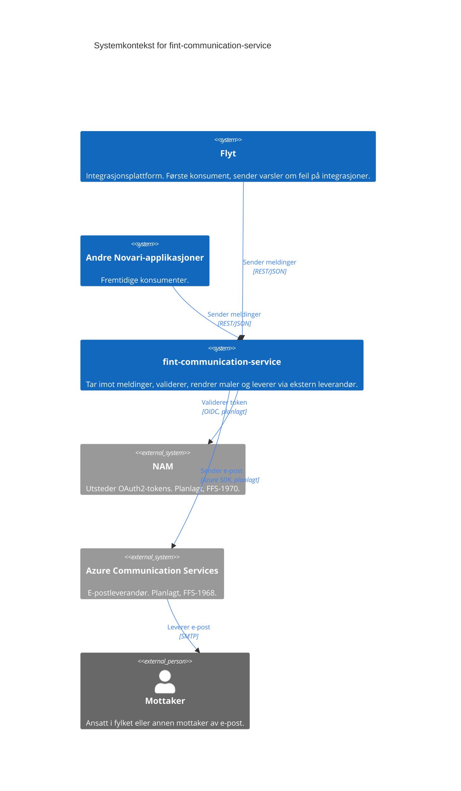

Bare REST-kallene fra konsumentene til tjenesten finnes i dag. Autentisering (FFS-1970) og utsending
via ACS (FFS-1968) er planlagt.

## C4 nivå 2: Containere

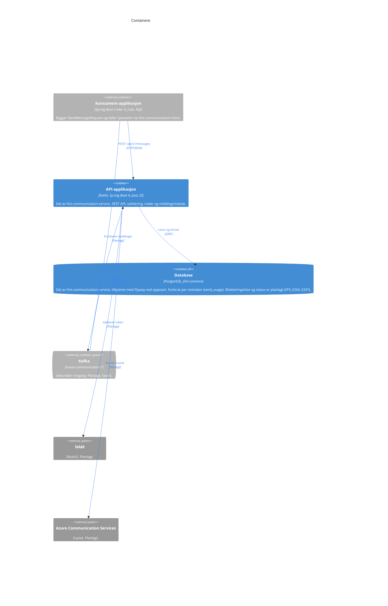

Blå bokser er en del av fint-communication-service, grå er eksterne. Tjenesten består av
API-applikasjonen og en Postgres-database (`fint-common`). Databasen har tabellen `send_usage` for grensene per mottaker; flere
tabeller kommer med oppgavene som trenger dem. API-applikasjonen holder ingen
tilstand i minnet og kan skaleres horisontalt. Malene ligger i applikasjonens classpath og er ikke en
egen container.

## C4 nivå 3: Komponenter

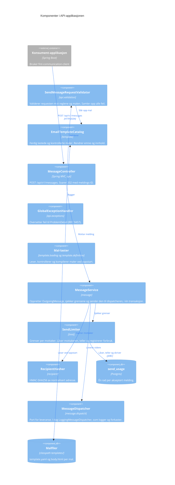

Alle blå bokser er komponenter i API-applikasjonen. `GlobalExceptionHandler` har ingen piler: Spring kaller den når en av de andre komponentene kaster
en feil. Leveransen fra `MessageDispatcher` til ACS er planlagt (FFS-1968) og vist på nivå 2.

### Pakkestruktur

```
no.novari.communication
├── Application.kt
├── config/              ClockConfiguration
├── api/                 MessageController
│   ├── exceptions/      GlobalExceptionHandler, RequestValidationException
│   └── validation/      SendMessageRequestValidator, ValidatedEmailRequest, ValidationError
├── limit/               SendLimiter, DatabaseSendLimiter, SlidingWindowLimit, LimitType,
│                        LimitExceededException, LimitProperties, LimitConfiguration,
│                        SendUsageRepository, SendUsageCleaner
├── message/             MessageService
│   ├── domain/          OutgoingMessage, MessagePayload, EmailPayload, MessageId,
│   │                    MessageStatus, MessageChannel, EmailAddress
│   └── dispatch/        MessageDispatcher, LoggingMessageDispatcher
├── recipient/           RecipientHasher, RecipientHash, RecipientHashingProperties,
│                        RecipientHashingConfiguration
├── retention/           RetentionCleanupJob, ExpiredRowsCleaner, RetentionProperties,
│                        RetentionConfiguration
└── template/            EmailTemplate, EmailTemplateCatalog, RenderedEmail
    ├── definition/      EmailTemplateParser, EmailTemplateStructureChecker,
    │                    EmailTemplateDefinition, VariableDefinition, ListDefinition,
    │                    TemplateDefinitionException
    └── loading/         ClasspathEmailTemplateLoader, EmailTemplateConfiguration
```

| Pakke                 | Ansvar                                                                                       |
|-----------------------|----------------------------------------------------------------------------------------------|
| `api`                 | HTTP-inngangen. Tar imot kontrakten fra `model`, validerer og oversetter til domenet.        |
| `api.validation`      | Validering av requesten mot reglene og mot malen. Samler opp alle feil.                      |
| `api.exceptions`      | Oversetter feil til ProblemDetail-responser (RFC 9457).                                      |
| `limit`               | Grenser for utsending (i dag per mottaker), forbrukstabellen og opprydning av den.           |
| `message`             | Mottak av meldinger (`MessageService`).                                                      |
| `message.domain`      | Den interne domenemodellen. Kanal-agnostisk på toppnivå.                                     |
| `message.dispatch`    | Porten for å levere en akseptert melding videre, og dagens implementasjon av den.            |
| `recipient`           | Pseudonymisering av mottakere: HMAC-SHA256 av normalisert adresse med hemmelig nøkkel.       |
| `retention`           | Planlagt opprydning av utløpte rader. Hver tabell registrerer sin egen `ExpiredRowsCleaner`. |
| `template`            | Ferdig lastede maler og rendering.                                                           |
| `template.definition` | Lesing og kontroll av malfiler.                                                              |
| `template.loading`    | Finner malene på classpath og registrerer katalogen som Spring-bean.                         |
| `config`              | Felles Spring-konfigurasjon (`Clock`).                                                       |

Domenet (`message.domain`) avhenger ikke av `api`, `template` eller Spring. Fra `model` bruker
domenet bare `Tenant`, slik at samme navn brukes i kontrakten, logger og senere i database og
metrikker. Resten av kontraktklassene i `model` er det bare `api` som kjenner.

## C4 nivå 4: Kode

Klassediagrammer for de sentrale typene i domenet og malsystemet.

### Melding

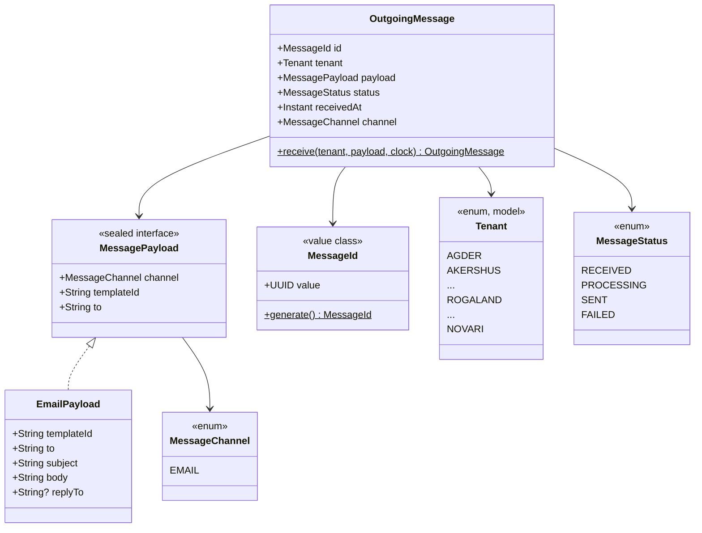

- `OutgoingMessage.receive` er eneste måte å opprette en ny melding på. Den genererer ID-en,
  setter status `RECEIVED` og tidspunktet fra en injisert `Clock`.
- `MessagePayload` er sealed, så hver kanal får sin egen payload-type. Nye kanaler, som SMS,
  legges til som nye implementasjoner.
- `EmailPayload` inneholder det ferdig rendrede emnet og innholdet. Malen er allerede brukt når
  payloaden opprettes, og `templateId` følger med som metadata.
- `Tenant` er en enum i `model`, med alle fylker, Oslo kommune (Bymiljøetaten), Riksantikvaren og
  Novari. Enum-navnet er den stabile identifikatoren i kontrakt, logger, database og metrikker.
- `EmailPayload` sjekker at feltene ikke er tomme når den opprettes (`require`). Det er en siste
  sikring etter valideringen i API-laget.

### Mal

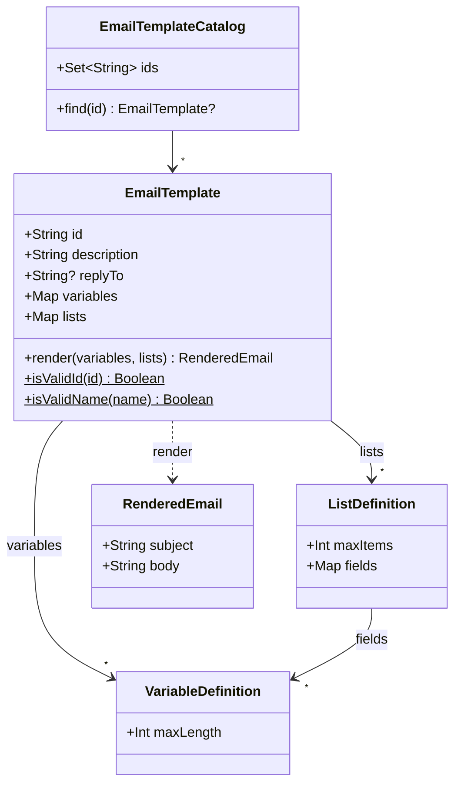

## Moduler og biblioteker

Repoet er et Gradle-multimodulprosjekt. Modulene er kodestruktur, ikke C4-containere: `app` er
API-applikasjonen på nivå 2, mens `client` og `model` er biblioteker som kjører inne i
konsument-applikasjonen.

| Modul    | Innhold                                                                                                                                                                     | Publiseres                            |
|----------|-----------------------------------------------------------------------------------------------------------------------------------------------------------------------------|---------------------------------------|
| `app`    | Spring Boot-tjenesten: API, validering, maler og meldingsflyt.                                                                                                              | Nei, deployes som container-image     |
| `model`  | API-kontrakten (`SendMessageRequest`, `Message`, `EmailMessage`, `Tenant`, `MessageAcceptedResponse`). Bare `jackson-annotations`, og bare ved kompilering (`compileOnly`). | `no.novari:fint-communication-model`  |
| `client` | HTTP-klient for API-et, blokkerende (`RestClient`) og reactive (`WebClient`).                                                                                               | `no.novari:fint-communication-client` |

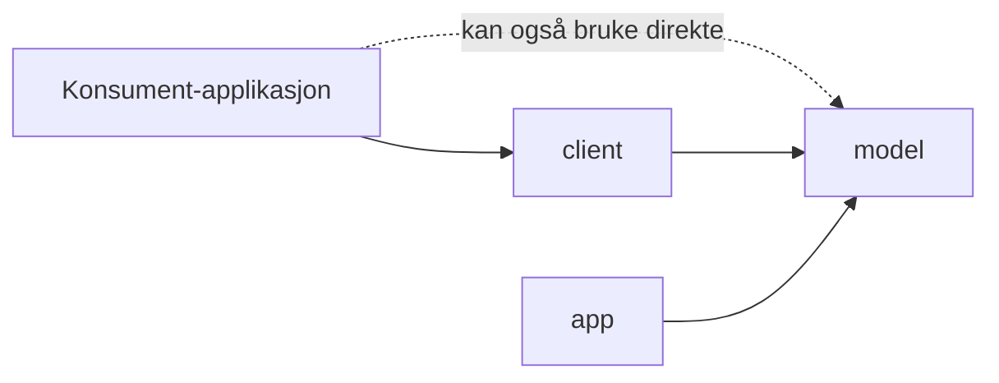

`model` og `client` er kompilert for Java 21 og fungerer med både Spring Boot 3 og 4. `app` kjører
på Java 25 og Spring Boot 4. Både `app` og `client` bruker kontraktklassene i `model`, så
tjenesten og klienten kan ikke komme ut av takt med hverandre.

## Sende melding: dataflyt

Sekvensdiagrammene her og under er C4s dynamiske diagrammer: de viser hvordan komponentene fra
nivå 3 samarbeider i en bestemt flyt.

### Kontrakt

```json
POST /api/v1/messages
{
  "tenant": "ROGALAND",
  "message": {
    "channel": "EMAIL",
    "to": "ola@rogfk.no",
    "templateId": "flyt/integrasjonsfeil",
    "variables": { "antallFeil": "8", "fra": "06.10.2026 kl. 09.00", "til": "06.10.2026 kl. 12.00" },
    "lists": { "integrasjoner": [ { "navn": "ACOS", "antallFeil": "3" } ] }
  }
}

202 Accepted
{ "id": "0d6f7e0a-3c1b-4f53-9a35-0a4f8f7f2b11" }
```

Eksempelet viser en tenkt mal; repoet inneholder foreløpig ingen maler.

`message` er polymorf: `Message` er et sealed interface i `model`, og `channel` bestemmer hvilken
subtype JSON-en leses som (`@JsonTypeInfo`/`@JsonSubTypes`). I dag finnes bare `EmailMessage`
(`"EMAIL"`). En ny kanal, som SMS, legges til som en ny subtype uten å bryte kontrakten, og typen
garanterer at en request har nøyaktig én melding. Klienten sender aldri emne, innhold eller
svaradresse; alt det kommer fra malen.

`jackson-annotations` er en `compileOnly`-avhengighet i `model`. Annotasjonene ligger i samme pakke
for Jackson 2 og 3, så kontrakten fungerer med begge uten at `model` får avhengigheter ved kjøring.

### Sekvens for en gyldig request

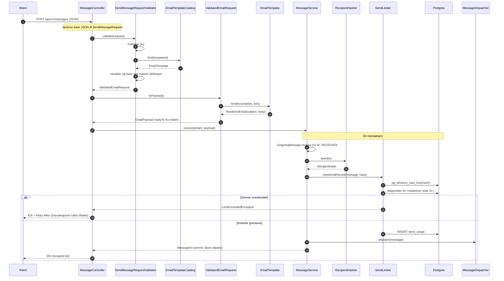

1. Valideringen samler opp alle feil før den eventuelt avviser requesten, så klienten får vite om
   alle ugyldige felt på én gang.
2. Malen rendres mens requesten behandles (synkront), ikke ved utsending. Feil i verdiene blir
   dermed 400 med en gang, og meldingen er uavhengig av senere endringer i malen.
3. Svaret 202 betyr at meldingen er akseptert, ikke at den er levert. Leveransen skjer asynkront
   (planlagt i FFS-1968).
4. Rekkefølgen er validering → blokkeringsliste (planlagt, FFS-2336) → grenser → registrering av
   forbruk → dispatch → 202. Forbruket registreres bare når alle grenser passerer, og i samme
   transaksjon som dispatch: feiler dispatch, rulles forbruket tilbake. Se [Grenser](#grenser).

### Hva skjer med meldingen etter 202

`MessageDispatcher` er porten mellom mottak og leveranse. Dagens implementasjon,
`LoggingMessageDispatcher`, logger `id`, `tenant`, `channel` og `templateId` og forkaster meldingen.
Databasen finnes, men meldinger lagres ikke ennå (FFS-2337), og det finnes ingen kø eller
leverandøradapter.

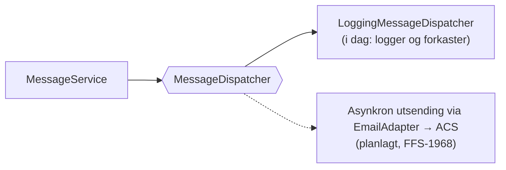

Controller og service endres ikke når implementasjonen byttes ut.

### Validering

| Felt                 | Regel                                                                                                                                               |
|----------------------|-----------------------------------------------------------------------------------------------------------------------------------------------------|
| `tenant`             | Påkrevd, én av verdiene i `Tenant` (f.eks. `ROGALAND`). Sjekkes av Jackson; ukjent verdi gir 400 med liste over gyldige verdier.                    |
| `message`            | Påkrevd. Sjekkes av Jackson.                                                                                                                        |
| `message.channel`    | Påkrevd, én av kanalene i `@JsonSubTypes` (i dag `EMAIL`). Sjekkes av Jackson; manglende eller ukjent verdi gir 400 med liste over gyldige verdier. |
| `message.to`         | Påkrevd, én adresse uten visningsnavn, domene med punktum, maks 254 tegn (RFC 5321).                                                                |
| `message.templateId` | Påkrevd, formatet `<team>/<mal>`, malen må finnes.                                                                                                  |
| `message.variables`  | Nøyaktig de variablene malen deklarerer.                                                                                                            |
| `message.lists`      | Nøyaktig de listene malen deklarerer, mellom 1 og `maxItems` elementer.                                                                             |
| Hver verdi           | Ikke blank, ingen linjeskift eller andre kontrolltegn, maks `maxLength` tegn.                                                                       |

## Feilhåndtering

Alle feil returneres som `application/problem+json` (RFC 9457). `GlobalExceptionHandler` arver fra
Springs `ResponseEntityExceptionHandler`, slik at også rammeverkets feil (405, 415 osv.) får samme
format.

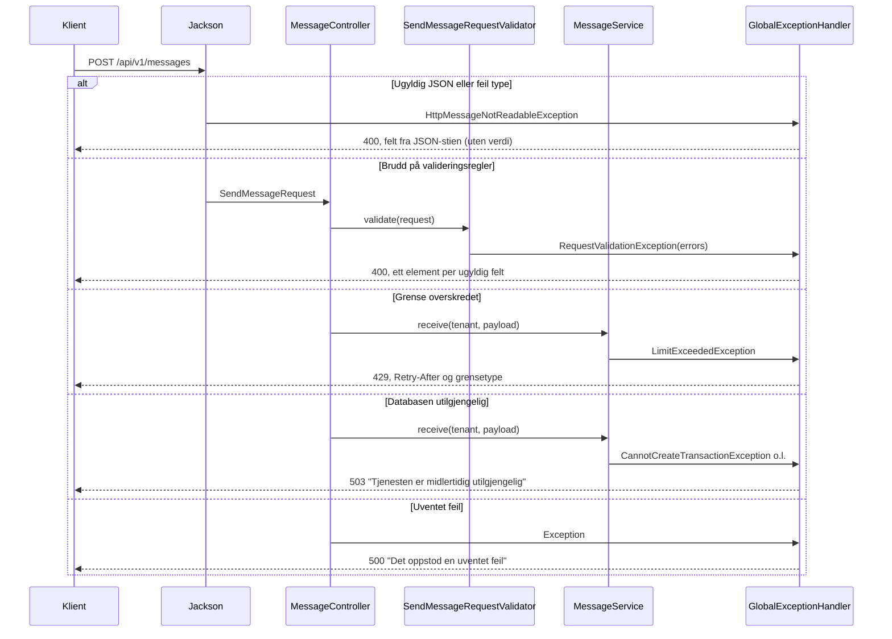

| Status | Når                                                          | Innhold                                                    |
|--------|--------------------------------------------------------------|------------------------------------------------------------|
| 202    | Requesten er gyldig og meldingen akseptert.                  | `{"id": "<uuid>"}`                                         |
| 400    | Ugyldig JSON, feil type eller brudd på valideringsregler.    | `detail` og `errors: [{field, message}]`                   |
| 401    | Mangler eller ugyldig token. **Planlagt** (FFS-1970).        | ProblemDetail                                              |
| 405    | Annen HTTP-metode enn POST.                                  | ProblemDetail                                              |
| 415    | Body er ikke `application/json`.                             | ProblemDetail                                              |
| 429    | Mottakeren har nådd en grense. Meldingen er ikke lagret.     | ProblemDetail med `limit`, header `Retry-After` i sekunder |
| 500    | Uventet feil.                                                | Generell melding; stacktracen logges, men returneres ikke. |
| 503    | Databasen er utilgjengelig eller låsen ble ikke fått på 5 s. | Generell melding. Meldingen er ikke akseptert.             |

Eksempel på 400:

```json
{
  "title": "Bad Request",
  "status": 400,
  "detail": "Requesten inneholder ugyldige felt",
  "instance": "/api/v1/messages",
  "errors": [
    { "field": "message.to", "message": "må være én gyldig e-postadresse" },
    { "field": "message.variables.antallFeil", "message": "kan ikke være lengre enn 6 tegn" }
  ]
}
```

Eksempel på 429:

```json
HTTP/1.1 429
Retry-After: 3000

{
  "title": "Too Many Requests",
  "status": 429,
  "detail": "Mottakeren har fått for mange meldinger. Prøv igjen senere.",
  "instance": "/api/v1/messages",
  "limit": "mottaker"
}
```

503 gis for `CannotCreateTransactionException`, `DataAccessResourceFailureException` og
`PessimisticLockingFailureException` (lock timeout; Spring oversetter ikke SQLSTATE `55P03`, så
`SendUsageRepository` gjør det selv), og for `TransactionSystemException` når
rollback feilet fordi forbindelsen er brutt. Andre databasefeil er bugs og blir 500.

En feil som oppstår i rendering eller domene etter at valideringen har godkjent requesten, er en bug
og blir 500.

## Malsystemet

All e-post sendes via en mal. Klienter kan ikke sende fritekst. Det reduserer risikoen for at
personopplysninger havner i e-post ved en feil, og gjør at alt innhold som sendes, er gjennomgått i
en PR.

### Struktur på disk

```
app/src/main/resources/templates/
└── <team>/
    └── email/
        └── <mal>/
            ├── template.yaml
            └── body.html
```

- Mal-ID-en er `<team>/<mal>`. Kanalen ligger i stien og bestemmes i requesten av `message.channel`:
  en `EMAIL`-melding slår bare opp blant e-postmalene.
- Hvert team eier sin mappe via `.github/CODEOWNERS`. Nye maler og endringer godkjennes i PR.
- Endring av en mal krever ny deploy.

`template.yaml`:

```yaml
description: Periodisk oppsummering av feil på integrasjoner i Flyt.
subject: "Flyt: {{antallFeil}} feil på integrasjoner"
replyTo: no-reply@novari.no     # valgfri
variables:
  antallFeil: { maxLength: 6 }
lists:
  integrasjoner:
    maxItems: 100
    fields:
      navn: { maxLength: 100 }
      antallFeil: { maxLength: 6 }
```

`body.html` inneholder bare innholdet i Mustache. Layout rundt innholdet legges på sentralt
(**planlagt**, FFS-1969).

### Lasting ved oppstart

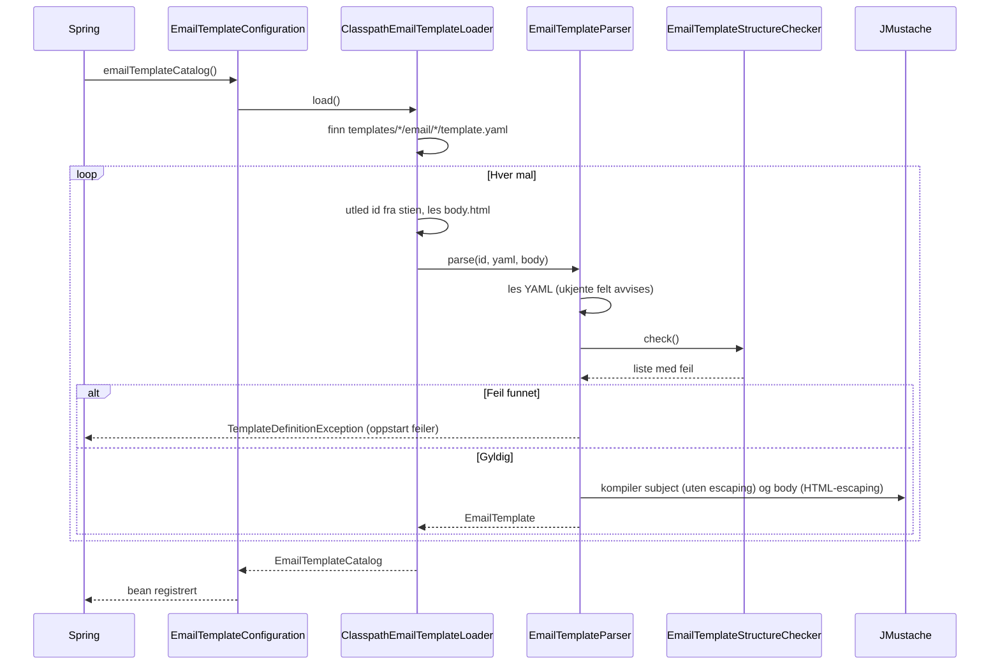

En ugyldig mal stopper oppstarten. Testen `all production templates are valid` gjør den samme
kontrollen, så feilen oppdages i CI før deploy.

### Regler for maler

Kontrollen gjøres av `EmailTemplateStructureChecker` med en egen gjennomgang av Mustache-taggene.

| Regel                                                                                                      | Hvorfor                                                     |
|------------------------------------------------------------------------------------------------------------|-------------------------------------------------------------|
| Variabler er påkrevde strenger med `maxLength` mellom 1 og 1000.                                           | Ingen variabel kan i praksis gjøre malen til fritekst.      |
| Lister har `maxItems` mellom 1 og 100 og minst ett felt.                                                   | Øvre grense for innhold kan regnes ut og ses i review.      |
| Lister brukes bare som section, og inne i en liste bare listens egne felt.                                 | Valideringen av requesten blir eksakt.                      |
| Alt som er deklarert, brukes, og alt som brukes, er deklarert.                                             | Malen og definisjonen kan ikke komme ut av takt.            |
| Ikke tillatt: `{{{ }}}`, `{{& }}`, inverterte sections, partials, nøstede sections, endring av delimitere. | Alle verdier escapes, og strukturen er enkel å kontrollere. |
| `subject` er én linje uten sections.                                                                       | Emnet er ren tekst.                                         |
| `replyTo` er en gyldig adresse hvis den er satt.                                                           |                                                             |
| Navn har formen `antallFeil` (bokstav først, deretter bokstaver og tall).                                  | Unngår JMustaches spesialsyntaks (`a.b`, `-first`).         |

### Rendering

JMustache brukes direkte (ikke `spring-boot-starter-mustache`, som også setter opp
MVC-visninger).

| Del         | Escaping | Konsekvens                                                                              |
|-------------|----------|-----------------------------------------------------------------------------------------|
| `body.html` | HTML     | `<script>` i en verdi blir `&lt;script&gt;`.                                            |
| `subject`   | Ingen    | Emnet er ren tekst. Linjeskift er umulig fordi verdier ikke kan inneholde kontrolltegn. |

Lister rendres ved at blokken mellom `{{#liste}}` og `{{/liste}}` gjentas for hvert element:

```html
{{#integrasjoner}}
<tr><td>{{navn}}</td><td>{{antallFeil}}</td></tr>
{{/integrasjoner}}
```

## Meldingsstatus

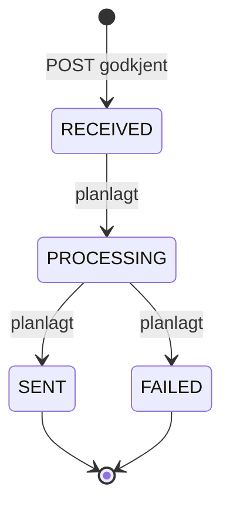

I dag opprettes alle meldinger med status `RECEIVED`, og det finnes ingen overganger. Overganger,
og om `FAILED` skal kunne prøves på nytt, avgjøres sammen med leveransen i FFS-1968.

## Database

Tjenesten har en egen Postgres-database, `fint-common`, som Flais setter opp fra `spec.database` i
`flais.yaml`. Tabeller som gjelder én tenant får `tenant_id`.

| Del        | Løsning                                                                                                           |
|------------|-------------------------------------------------------------------------------------------------------------------|
| Tilgang    | Spring Data JDBC. Egen SQL skrives med `JdbcClient`.                                                              |
| Skjema     | Flyway, `classpath:db/migration`, kjøres ved oppstart. `V1__baseline` er tom.                                     |
| Tabeller   | `send_usage` (`V2`): forbruk per mottaker for grensene.                                                           |
| Readiness  | `db` er med i readiness-gruppen; podden tas ut av trafikk når databasen ikke svarer.                              |
| Opprydning | `RetentionCleanupJob` kjører kl. 03.15 (Europe/Oslo) og kaller hver `ExpiredRowsCleaner`.                         |
| Retensjon  | Metadata om meldinger beholdes i 60 dager (`communication.retention.metadata`). `send_usage` beholdes i 24 timer. |

Planlagte tabeller:

| Oppgave  | Innhold                                      |
|----------|----------------------------------------------|
| FFS-2334 | Grenser per tenant og totalt i `send_usage`. |
| FFS-2336 | Blokkeringsliste (hashet mottaker).          |
| FFS-2337 | `message`-tabellen med status.               |

### Mottaker-hashing

Mottakeradresser lagres aldri i klartekst. `RecipientHasher` normaliserer adressen (`trim`,
`lowercase`) og beregner HMAC-SHA256 med en hemmelig nøkkel. Resultatet (`RecipientHash`) er 64
hex-tegn og brukes som nøkkel i tabellene som trenger å kjenne igjen en mottaker.

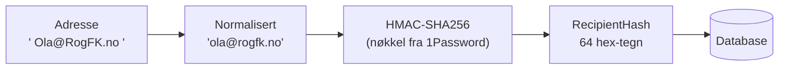

| Egenskap         | Verdi                                                                                    |
|------------------|------------------------------------------------------------------------------------------|
| Nøkkel           | `COMMUNICATION_RECIPIENT_HASHING_KEY`, base64, minst 32 bytes. Fra 1Password-operatoren. |
| Mangler nøkkelen | Oppstarten feiler med en melding som nevner variabelnavnet, aldri verdien.               |
| Logging          | Verken nøkkel, adresse eller hash logges. `toString()` maskerer.                         |
| Nøkkelrotasjon   | Ikke støttet. Se under.                                                                  |

Hashen kan ikke regnes om uten klartekstadressen, som tjenesten ikke har. Et nøkkelbytte gjør
derfor alle lagrede hasher ugjenkjennelige. Tellerne (FFS-2333/2334) lever bare i timer eller dager
og tåler det. Blokkeringslisten (FFS-2336) gjør ikke det, så hvis rotasjon blir aktuelt, må den få
`key_id` og oppslag med både gammel og ny nøkkel. Dette er et åpent punkt for FFS-2336.

### Grenser

Grensene er et sikkerhetsnett over konsumentenes egne grenser. Verdiene ligger i `application.yaml`
og endres med PR og deploy. Ugyldige verdier (ikke positive, eller `per-day` lavere enn `per-hour`)
stopper oppstarten.

| Grense       | Konfig                                    | Verdi | Vindu (glidende) |
|--------------|-------------------------------------------|-------|------------------|
| Per mottaker | `communication.limits.recipient.per-hour` | 10    | Siste 60 min     |
| Per mottaker | `communication.limits.recipient.per-day`  | 40    | Siste 24 t       |

`send_usage` har én rad per akseptert melding:

| Kolonne          | Innhold                                                              |
|------------------|----------------------------------------------------------------------|
| `message_id`     | Meldings-ID (primærnøkkel).                                          |
| `recipient_hash` | `RecipientHash`. Global, så alle tenants deler teller.               |
| `tenant`         | Enum-navnet. Brukes av grensene per tenant (FFS-2334).               |
| `sent_at`        | Tidspunkt fra `Clock`, lest etter at låsen er tatt (se Samtidighet). |

- **Samtidighet.** `DatabaseSendLimiter` tar `pg_advisory_xact_lock` på de første 64 bitene av
  hashen før den teller. Samtidige meldinger til samme mottaker, også fra flere pods, går dermed
  etter hverandre. Låsen slippes ved commit eller rollback, og venter høyst 5 sekunder
  (`lock_timeout`, gir 503). Tidspunktet som brukes til vinduene og lagres i `sent_at`, leses
  først når låsen er tatt, ikke `receivedAt`. Ellers kunne en forespørsel som ventet på låsen, bli
  avvist for forbruk som allerede hadde gått ut av vinduet, eller bli registrert for tidlig, slik at
  neste melding slapp gjennom før det var gått et helt vindu. FFS-2334 tar låser for tenant og totalt i fast rekkefølge etter
  mottakeren, så det ikke kan oppstå vranglås.
- **Retry-After.** For hvert vindu som er brutt, er neste ledige tidspunkt når raden nummer
  `antall − grense` (eldste først) faller ut av vinduet. Svaret er det seneste av vinduene, i hele
  sekunder rundet opp, minst 1.
- **Transaksjon.** Lås, telling, registrering og dispatch skjer i samme transaksjon
  (`MessageService.receive`). En avvist eller feilet melding etterlater ingen rad.
- **Opprydning.** `SendUsageCleaner` sletter rader eldre enn 24 timer.

## Personvern og logging

Mottaker, emne, innhold og variabelverdier kan inneholde personopplysninger.

| Tiltak                                                                                                  | Hvor                                            |
|---------------------------------------------------------------------------------------------------------|-------------------------------------------------|
| Klienter kan ikke sende fritekst; alt innhold kommer fra gjennomgåtte maler.                            | Malsystemet                                     |
| `toString()` maskerer mottaker, emne, innhold og verdier.                                               | `EmailMessage`, `EmailPayload`, `RenderedEmail` |
| Feilmeldinger gjentar aldri innsendte verdier. Navn tas bare med når de har formen til et variabelnavn. | `SendMessageRequestValidator`                   |
| Jacksons feilmeldinger, som kan sitere verdier, brukes ikke i respons eller logg; bare JSON-stien.      | `GlobalExceptionHandler`                        |
| Loggen ved mottak inneholder bare `id`, `tenant`, `channel` og `templateId`.                            | `LoggingMessageDispatcher`                      |
| Mottakere lagres bare som HMAC-hash. Nøkkel, adresse og hash logges aldri.                              | `RecipientHasher`                               |
| 429-svaret og WARN-loggen har bare grensetype, `tenant` og meldings-ID, aldri adresse eller hash.       | `GlobalExceptionHandler`                        |
| En test sjekker at adressen ikke finnes i logg, i noen tekstkolonne i databasen eller i metrikk-tagger. | `RecipientPrivacyTest`                          |

`replyTo` kommer fra malen og er en Novari-adresse, så den vises umaskert.

## Drift

| Egenskap      | Verdi                                                                                                                                                       |
|---------------|-------------------------------------------------------------------------------------------------------------------------------------------------------------|
| Image         | `ghcr.io/fintlabs/fint-communication-service`, distroless Java 25                                                                                           |
| Namespace     | `fintlabs-no` (én deployment for alle tenants)                                                                                                              |
| Eksponering   | Bare intern i clusteret (ingen ingress)                                                                                                                     |
| Port          | 8080                                                                                                                                                        |
| Probes        | `/actuator/health` (startup), `/actuator/health/liveness`, `/actuator/health/readiness`                                                                     |
| Ressurser     | 256–512 Mi minne, 50–500m CPU, 1 replika                                                                                                                    |
| Database      | Postgres `fint-common` via Flais (`spec.database`). Readiness inkluderer `db`.                                                                              |
| Hemmeligheter | 1Password-item via `spec.onePassword.itemPath` (beta: `vaults/aks-beta-vault/items/fint-communication-service`), med `COMMUNICATION_RECIPIENT_HASHING_KEY`. |
| Miljøer       | beta (`aks-beta-fint-2021-11-23`). Produksjon (`api`) er ikke satt opp.                                                                                     |
| Bygg/deploy   | Push til `main` bygger image og deployer til beta (GitHub Actions).                                                                                         |

All tilstand ligger i databasen, så API-applikasjonen kan skaleres horisontalt. Opprydningsjobben
kjører da på hver replika; slettingene er idempotente, så det gjør ingen skade.

## Videre utvikling

| Oppgave       | Innhold                                                                            |
|---------------|------------------------------------------------------------------------------------|
| FFS-1968      | `EmailAdapter` mot ACS, asynkron utsending, statusoverganger.                      |
| FFS-1969      | Sentral layout rundt rendret innhold, `text/plain`-variant, HTML-regler for maler. |
| FFS-1970      | Bearer-token fra NAM (Spring Security), 401 som ProblemDetail.                     |
| FFS-1971      | JSON-logging, korrelasjon-ID, metrics til Prometheus.                              |
| FFS-2334–2337 | Grenser per tenant og totalt, metrikker, blokkeringsliste og meldingsstatus.       |
| Fase 6        | Kafka som sekundær inngang, med samme validering og mottak som REST.               |

## Sentrale beslutninger

| Beslutning                                                                                                          | Begrunnelse                                                                                                  |
|---------------------------------------------------------------------------------------------------------------------|--------------------------------------------------------------------------------------------------------------|
| All e-post sendes via mal; ingen fritekst.                                                                          | Begrenser risikoen for personopplysninger i e-post; alt innhold gjennomgås i PR.                             |
| Maler er knyttet til kanal (`<team>/<kanal>/<mal>`).                                                                | Formatene er forskjellige per kanal; egne typer per kanal i koden.                                           |
| Team først i stien.                                                                                                 | Én CODEOWNERS-linje per team.                                                                                |
| Variabler er strenger; lister er typet med `maxItems` og felt.                                                      | Øvre grense for innhold kan regnes ut; tall og datoer formateres av klienten.                                |
| `replyTo` defineres i malen, ikke i requesten.                                                                      | Ingen risiko for personlige adresser som svaradresse.                                                        |
| Polymorf kontrakt (`{tenant, message: {channel, ...}}`) med sealed `Message`.                                       | Nøyaktig én melding følger av typen; nye kanaler er nye subtyper uten brudd i kontrakten.                    |
| Malen rendres ved mottak.                                                                                           | Feil blir 400 med en gang; meldingen er uavhengig av senere malendringer.                                    |
| ProblemDetail (RFC 9457) for alle feil.                                                                             | Standardformat, støttet direkte av Spring.                                                                   |
| JMustache direkte, egen kontroll av taggene.                                                                        | Logic-less maler; reglene kan håndheves ved oppstart.                                                        |
| Port (`MessageDispatcher`) mellom mottak og leveranse.                                                              | Leveransen kan byttes ut uten å endre API eller service.                                                     |
| `model` uten avhengigheter ved kjøring (bare `compileOnly` `jackson-annotations`), `client` uten autokonfigurasjon. | Bibliotekene kan brukes i alle Spring Boot 3- og 4-applikasjoner (Jackson 2 og 3).                           |
| Spring Data JDBC, ikke JPA.                                                                                         | Immutable Kotlin-klasser uten proxies. Tellere (`INSERT … ON CONFLICT`) og opprydning er native SQL uansett. |
| Mottakere lagres som HMAC-SHA256 med hemmelig nøkkel, ikke ren SHA-256.                                             | E-postadresser er lette å gjette; uten nøkkelen kan hashen ikke slås opp mot en liste med adresser.          |
| Ingen nøkkelrotasjon foreløpig.                                                                                     | Ingen tabeller trenger det ennå; blokkeringslisten (FFS-2336) må ta stilling til det.                        |
| Opprydning uten ShedLock.                                                                                           | Slettingene er idempotente; samtidige kjøringer på flere replikaer gjør ingen skade.                         |
| Grenser med `pg_advisory_xact_lock` på mottaker-hashen.                                                             | Atomisk på tvers av pods uten retry-logikk eller egen låsetabell.                                            |
| Én rad per akseptert melding i `send_usage`, ikke aggregerte bøtter.                                                | Ekte glidende vindu og eksakt `Retry-After`; få rader ved disse volumene.                                    |
| Forbruk og dispatch i samme transaksjon.                                                                            | En melding som ikke ble akseptert, teller ikke, så klientens nye forsøk straffes ikke.                       |
| Fail-closed: databasen utilgjengelig gir 503.                                                                       | Grensene kan ikke omgås ved at databasen er nede.                                                            |
