# Arkitektur

Dokumentet beskriver hvordan fint-communication-service er bygget opp i dag. Arkitekturen er
beskrevet med [C4-modellen](https://c4model.com): systemkontekst (nivå 1), containere (nivå 2),
komponenter (nivå 3) og kode (nivå 4), supplert med sekvensdiagrammer for de viktigste flytene.
Deler som ennå ikke er implementert, er merket **planlagt** og viser til oppgaven under
[FFS-1865](https://novari-iks.atlassian.net/browse/FFS-1865).

## Innhold

1. [C4 nivå 1: Systemkontekst](#c4-nivå-1-systemkontekst)
2. [C4 nivå 2: Containere](#c4-nivå-2-containere)
3. [C4 nivå 3: Komponenter](#c4-nivå-3-komponenter)
4. [C4 nivå 4: Kode](#c4-nivå-4-kode)
5. [Moduler og biblioteker](#moduler-og-biblioteker)
6. [Sende melding: dataflyt](#sende-melding-dataflyt)
7. [Feilhåndtering](#feilhåndtering)
8. [Malsystemet](#malsystemet)
9. [Meldingsstatus](#meldingsstatus)
10. [Database](#database)
11. [Personvern og logging](#personvern-og-logging)
12. [Drift](#drift)
13. [Videre utvikling](#videre-utvikling)
14. [Sentrale beslutninger](#sentrale-beslutninger)

## C4 nivå 1: Systemkontekst

fint-communication-service er en felles Novari-tjeneste for utgående meldinger. Applikasjoner
sender en melding hit med mal-ID, mottaker og verdier. Tjenesten validerer, rendrer malen og
leverer meldingen videre til en ekstern leverandør. E-post er første kanal.

Tjenesten er én multi-tenant deployment, bare tilgjengelig internt i clusteret. Tenant er
organisasjonen meldingen sendes på vegne av: et fylke, Oslo kommune (Bymiljøetaten),
Riksantikvaren eller Novari (til testing). Gyldige tenants er enumen `Tenant` i `model`.


REST-kallene fra konsumentene og utsendingen via ACS finnes i dag. ACS-ressursen er ikke opprettet ennå
(FFS-1965), så miljøene bruker foreløpig leverandøren `logging`, som logger og forkaster meldingen
(se [Hva skjer med meldingen etter 202](#hva-skjer-med-meldingen-etter-202)). Autentisering
(FFS-1970) er planlagt.

## C4 nivå 2: Containere

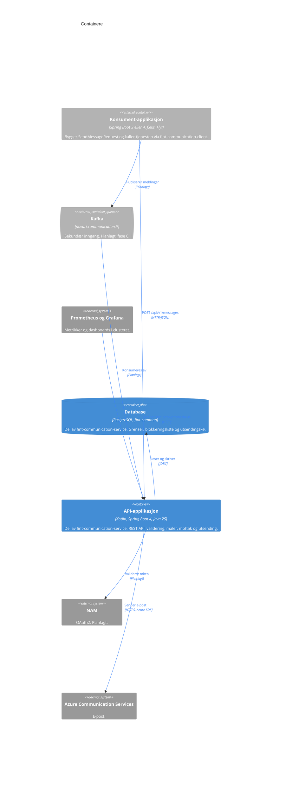

Blå bokser er en del av fint-communication-service, grå er eksterne. Tjenesten består av
API-applikasjonen og en Postgres-database (`fint-common`), som migreres med Flyway ved oppstart.
Databasen har tabellene `send_usage` for grensene per mottaker, tenant og totalt,
`recipient_blocklist` for blokkeringslisten og `dispatch_queue` for meldinger som venter på å bli
sendt. Meldingsstatus kommer i FFS-2337.
Prometheus scraper `/actuator/prometheus` via en PodMonitor som Flais lager. Dashboardet ligger i
`grafana/`, og varslene og hva vakthavende gjør er beskrevet i [runbooken](runbook.md).
API-applikasjonen holder ingen tilstand i minnet og kan skaleres horisontalt; køen ligger i
databasen og deles av alle replikaer. Malene ligger i
applikasjonens classpath og er ikke en egen container.

## C4 nivå 3: Komponenter

```mermaid
%%{init: {"c4": {"c4ShapeMargin": 120}}}%%
C4Component
    title Komponenter i API-applikasjonen

    Component(handler, "GlobalExceptionHandler", "api.exceptions", "Oversetter feil til ProblemDetail (RFC 9457).")
    Container_Ext(konsumentApp, "Konsument-applikasjon", "Spring Boot", "Bruker fint-communication-client.")
    Component(catalog, "EmailTemplateCatalog", "template", "Lastede maler. Rendrer emne og innhold.")
    Component(loader, "Mal-laster", "template.loading og .definition", "Leser og kompilerer maler ved oppstart.")

    Component(hasher, "RecipientHasher", "recipient", "HMAC-SHA256 av normalisert adresse.")
    Component(controller, "MessageController", "Spring MVC, api", "POST /api/v1/messages. Svarer 202 med ID.")
    Component(validator, "SendMessageRequestValidator", "api.validation", "Validerer mot reglene og malen.")
    ComponentDb(files, "Malfiler", "classpath templates/", "template.yaml og body.html per mal.")

    Component(blocklist, "RecipientBlocklist", "blocklist", "Avviser opt-out og aktiv hard bounce.")
    Component(service, "MessageService", "message", "Blokkering, grenser og dispatch i én transaksjon.")
    Component(limiter, "SendLimiter", "limit", "Grenser per mottaker, tenant og totalt.")
    ComponentDb(usage, "send_usage", "Postgres", "Én rad per akseptert melding.")

    ComponentDb(blocked, "recipient_blocklist", "Postgres", "Én rad per blokkert hash og årsak.")
    Component(dispatcher, "MessageDispatcher", "message.dispatch", "Port for leveranse. Legger meldingen i køen.")
    ComponentDb(queue, "dispatch_queue", "Postgres", "Meldinger som venter på utsending, kryptert innhold.")
    Component(usageMetrics, "LimitUsageMetrics", "limit", "Utnyttelse av grensene per tenant og totalt, hvert minutt.")

    System_Ext(acs, "Azure Communication Services", "E-postleverandør.")
    Component(adapter, "EmailAdapter", "email", "AcsEmailAdapter eller LoggingEmailAdapter, valgt med konfig.")
    Component(worker, "DispatchWorker", "message.dispatch", "Henter klare meldinger, sender og prøver igjen.")

    Rel(konsumentApp, controller, "POST /api/v1/messages", "HTTP/JSON")
    Rel(controller, validator, "Validerer")
    Rel(validator, catalog, "Slår opp mal")
    Rel(loader, catalog, "Bygger")
    Rel(loader, files, "Leser ved oppstart")
    Rel(controller, service, "Mottar melding")
    Rel(service, hasher, "Hasher mottaker")
    Rel(service, blocklist, "Sjekker blokkering")
    Rel(blocklist, blocked, "Slår opp", "JDBC")
    Rel(service, limiter, "Sjekker grenser")
    Rel(limiter, usage, "Låser, teller, skriver", "JDBC")
    Rel(service, dispatcher, "Leverer videre")
    Rel(usageMetrics, usage, "Teller per tenant", "JDBC")
    Rel(dispatcher, queue, "INSERT", "JDBC")
    Rel(worker, queue, "Reserverer, sletter", "SKIP LOCKED")
    Rel(worker, adapter, "send(id, e-post)")
    Rel(adapter, acs, "Sender e-post", "Azure SDK")

    UpdateRelStyle(konsumentApp, controller, $textColor="#3B82F6", $lineColor="#3B82F6")
    UpdateRelStyle(controller, validator, $textColor="#3B82F6", $lineColor="#3B82F6")
    UpdateRelStyle(validator, catalog, $textColor="#3B82F6", $lineColor="#3B82F6")
    UpdateRelStyle(loader, catalog, $textColor="#3B82F6", $lineColor="#3B82F6")
    UpdateRelStyle(loader, files, $textColor="#3B82F6", $lineColor="#3B82F6")
    UpdateRelStyle(controller, service, $textColor="#3B82F6", $lineColor="#3B82F6")
    UpdateRelStyle(service, hasher, $textColor="#3B82F6", $lineColor="#3B82F6")
    UpdateRelStyle(service, blocklist, $textColor="#3B82F6", $lineColor="#3B82F6")
    UpdateRelStyle(blocklist, blocked, $textColor="#3B82F6", $lineColor="#3B82F6")
    UpdateRelStyle(service, limiter, $textColor="#3B82F6", $lineColor="#3B82F6")
    UpdateRelStyle(limiter, usage, $textColor="#3B82F6", $lineColor="#3B82F6")
    UpdateRelStyle(service, dispatcher, $textColor="#3B82F6", $lineColor="#3B82F6")
    UpdateRelStyle(usageMetrics, usage, $textColor="#3B82F6", $lineColor="#3B82F6")
    UpdateRelStyle(dispatcher, queue, $textColor="#3B82F6", $lineColor="#3B82F6")
    UpdateRelStyle(worker, queue, $textColor="#3B82F6", $lineColor="#3B82F6")
    UpdateRelStyle(worker, adapter, $textColor="#3B82F6", $lineColor="#3B82F6")
    UpdateRelStyle(adapter, acs, $textColor="#3B82F6", $lineColor="#3B82F6")
    UpdateLayoutConfig($c4ShapeInRow="4", $c4BoundaryInRow="1")
```

Alle blå bokser er komponenter i API-applikasjonen. `GlobalExceptionHandler` har ingen piler: Spring kaller den når en av de andre komponentene kaster
en feil. `DispatchQueueMetrics` (størrelse og alder på køen) er ikke tegnet; den leser `dispatch_queue`
hvert minutt, som `LimitUsageMetrics` gjør med `send_usage`.

### Pakkestruktur

```
no.novari.communication
├── Application.kt
├── config/              ClockConfiguration
├── email/               EmailAdapter, EmailSendOutcome, AcsEmailAdapter, LoggingEmailAdapter,
│                        OperationIdPolicy, EmailProperties, EmailConfiguration
├── api/                 MessageController
│   ├── exceptions/      GlobalExceptionHandler, RequestValidationException
│   └── validation/      SendMessageRequestValidator, ValidatedEmailRequest, ValidationError
├── blocklist/           RecipientBlocklist, DatabaseRecipientBlocklist, RecipientBlockedException,
│                        BlocklistRepository, BlocklistCleaner
├── limit/               SendLimiter, DatabaseSendLimiter, SlidingWindowLimit, LimitType,
│                        LimitExceededException, LimitProperties, LimitConfiguration,
│                        SendUsageRepository, SendUsageCleaner
├── message/             MessageService
│   ├── domain/          OutgoingMessage, MessagePayload, EmailPayload, MessageId,
│   │                    MessageStatus, MessageChannel, EmailAddress
│   └── dispatch/        MessageDispatcher, QueueingMessageDispatcher, DispatchWorker,
│                        DispatchQueueRepository, QueuedMessage, PayloadCodec, PayloadCipher,
│                        DispatchProperties, DispatchConfiguration, DispatchMetrics,
│                        DispatchQueueMetrics
├── recipient/           RecipientHasher, RecipientHash, RecipientHashingProperties,
│                        RecipientHashingConfiguration, RecipientHashCli
├── retention/           RetentionCleanupJob, ExpiredRowsCleaner, RetentionProperties,
│                        RetentionConfiguration
└── template/            EmailTemplate, EmailTemplateCatalog, RenderedEmail
    ├── definition/      EmailTemplateParser, EmailTemplateStructureChecker,
    │                    EmailTemplateDefinition, VariableDefinition, ListDefinition,
    │                    TemplateDefinitionException
    └── loading/         ClasspathEmailTemplateLoader, EmailTemplateConfiguration
```

| Pakke                 | Ansvar                                                                                                                         |
|-----------------------|--------------------------------------------------------------------------------------------------------------------------------|
| `api`                 | HTTP-inngangen. Tar imot kontrakten fra `model`, validerer og oversetter til domenet.                                          |
| `api.validation`      | Validering av requesten mot reglene og mot malen. Samler opp alle feil.                                                        |
| `api.exceptions`      | Oversetter feil til ProblemDetail-responser (RFC 9457).                                                                        |
| `blocklist`           | Blokkeringslisten (opt-out og hard bounce): oppslag ved innsending, teller og opprydning.                                      |
| `email`               | Utsending av e-post via en leverandør: porten `EmailAdapter`, ACS-adapteren og `logging`-adapteren, og valget mellom dem.      |
| `limit`               | Grenser for utsending (per mottaker, per tenant og totalt), forbrukstabellen og opprydning av den.                             |
| `message`             | Mottak av meldinger (`MessageService`).                                                                                        |
| `message.domain`      | Den interne domenemodellen. Kanal-agnostisk på toppnivå.                                                                       |
| `message.dispatch`    | Porten for å levere en akseptert melding videre, køen i databasen og jobben som sender meldingene fra køen.                    |
| `recipient`           | Pseudonymisering av mottakere: HMAC-SHA256 av normalisert adresse med hemmelig nøkkel, og driftsverktøyet som beregner hashen. |
| `retention`           | Planlagt opprydning av utløpte rader. Hver tabell registrerer sin egen `ExpiredRowsCleaner`.                                   |
| `template`            | Ferdig lastede maler og rendering.                                                                                             |
| `template.definition` | Lesing og kontroll av malfiler.                                                                                                |
| `template.loading`    | Finner malene på classpath og registrerer katalogen som Spring-bean.                                                           |
| `config`              | Felles Spring-konfigurasjon (`Clock`).                                                                                         |

Domenet (`message.domain`) avhenger ikke av `api`, `template` eller Spring. `email` kjenner
`EmailPayload` fra domenet, men ikke køen; Azure-SDK-et brukes bare i `AcsEmailAdapter` og
`OperationIdPolicy`. Fra `model` bruker
domenet bare `Tenant`, slik at samme navn brukes i kontrakten, logger og senere i database og
metrikker. Resten av kontraktklassene i `model` er det bare `api` som kjenner.

## C4 nivå 4: Kode

Klassediagrammer for de sentrale typene i domenet og malsystemet.

### Melding

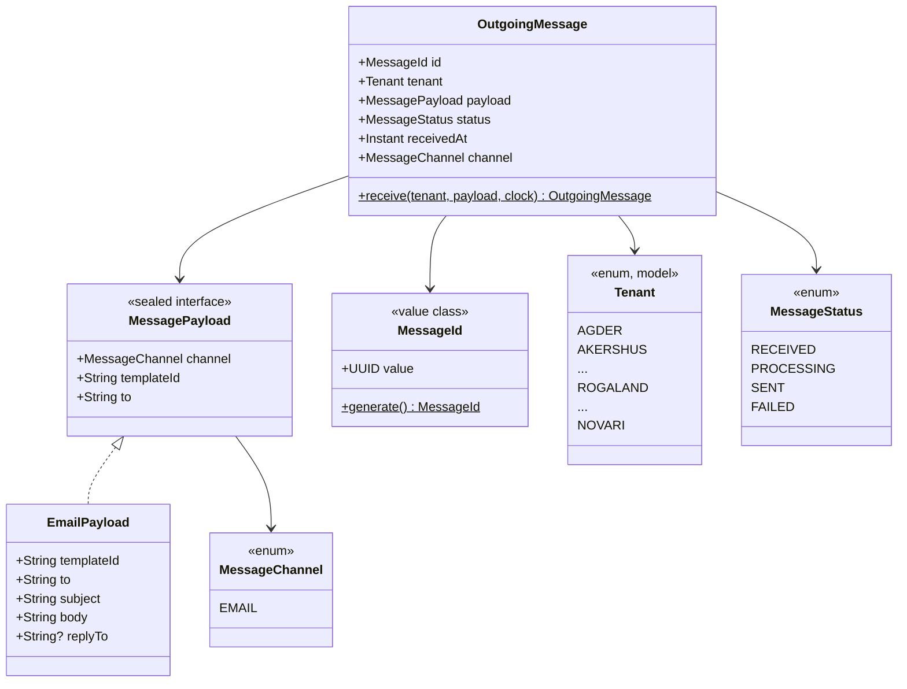

- `OutgoingMessage.receive` er eneste måte å opprette en ny melding på. Den genererer ID-en,
  setter status `RECEIVED` og tidspunktet fra en injisert `Clock`.
- `MessagePayload` er sealed, så hver kanal får sin egen payload-type. Nye kanaler, som SMS,
  legges til som nye implementasjoner.
- `EmailPayload` inneholder det ferdig rendrede emnet og innholdet. Malen er allerede brukt når
  payloaden opprettes, og `templateId` følger med som metadata.
- `Tenant` er en enum i `model`, med alle fylker, Oslo kommune (Bymiljøetaten), Riksantikvaren og
  Novari. Enum-navnet er den stabile identifikatoren i kontrakt, logger, database og metrikker.
- `EmailPayload` sjekker at feltene ikke er tomme når den opprettes (`require`). Det er en siste
  sikring etter valideringen i API-laget.

### Mal

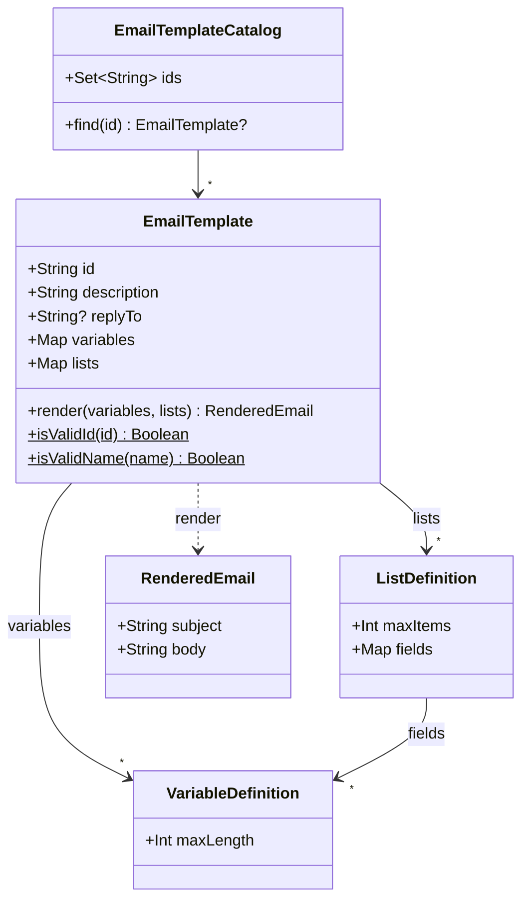

## Moduler og biblioteker

Repoet er et Gradle-multimodulprosjekt. Modulene er kodestruktur, ikke C4-containere: `app` er
API-applikasjonen på nivå 2, mens `client` og `model` er biblioteker som kjører inne i
konsument-applikasjonen.

| Modul    | Innhold                                                                                                                                                                     | Publiseres                            |
|----------|-----------------------------------------------------------------------------------------------------------------------------------------------------------------------------|---------------------------------------|
| `app`    | Spring Boot-tjenesten: API, validering, maler og meldingsflyt.                                                                                                              | Nei, deployes som container-image     |
| `model`  | API-kontrakten (`SendMessageRequest`, `Message`, `EmailMessage`, `Tenant`, `MessageAcceptedResponse`). Bare `jackson-annotations`, og bare ved kompilering (`compileOnly`). | `no.novari:fint-communication-model`  |
| `client` | HTTP-klient for API-et, blokkerende (`RestClient`) og reactive (`WebClient`).                                                                                               | `no.novari:fint-communication-client` |

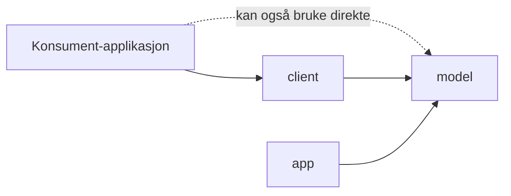

`model` og `client` er kompilert for Java 21 og fungerer med både Spring Boot 3 og 4. `app` kjører
på Java 25 og Spring Boot 4. Både `app` og `client` bruker kontraktklassene i `model`, så
tjenesten og klienten kan ikke komme ut av takt med hverandre.

## Sende melding: dataflyt

Sekvensdiagrammene her og under er C4s dynamiske diagrammer: de viser hvordan komponentene fra
nivå 3 samarbeider i en bestemt flyt.

### Kontrakt

```json
POST /api/v1/messages
{
  "tenant": "ROGALAND",
  "message": {
    "channel": "EMAIL",
    "to": "ola@rogfk.no",
    "templateId": "flyt/integrasjonsfeil",
    "variables": { "antallFeil": "8", "fra": "06.10.2026 kl. 09.00", "til": "06.10.2026 kl. 12.00" },
    "lists": { "integrasjoner": [ { "navn": "ACOS", "antallFeil": "3" } ] }
  }
}

202 Accepted
{ "id": "0d6f7e0a-3c1b-4f53-9a35-0a4f8f7f2b11" }
```

Eksempelet viser en tenkt mal; repoet har foreløpig bare testmalen `novari/test`, som brukes for å
verifisere utsending i et miljø (se [runbooken](runbook.md#verifisere-utsending)).

`message` er polymorf: `Message` er et sealed interface i `model`, og `channel` bestemmer hvilken
subtype JSON-en leses som (`@JsonTypeInfo`/`@JsonSubTypes`). I dag finnes bare `EmailMessage`
(`"EMAIL"`). En ny kanal, som SMS, legges til som en ny subtype uten å bryte kontrakten, og typen
garanterer at en request har nøyaktig én melding. Klienten sender aldri emne, innhold eller
svaradresse; alt det kommer fra malen.

`jackson-annotations` er en `compileOnly`-avhengighet i `model`. Annotasjonene ligger i samme pakke
for Jackson 2 og 3, så kontrakten fungerer med begge uten at `model` får avhengigheter ved kjøring.

### Sekvens for en gyldig request

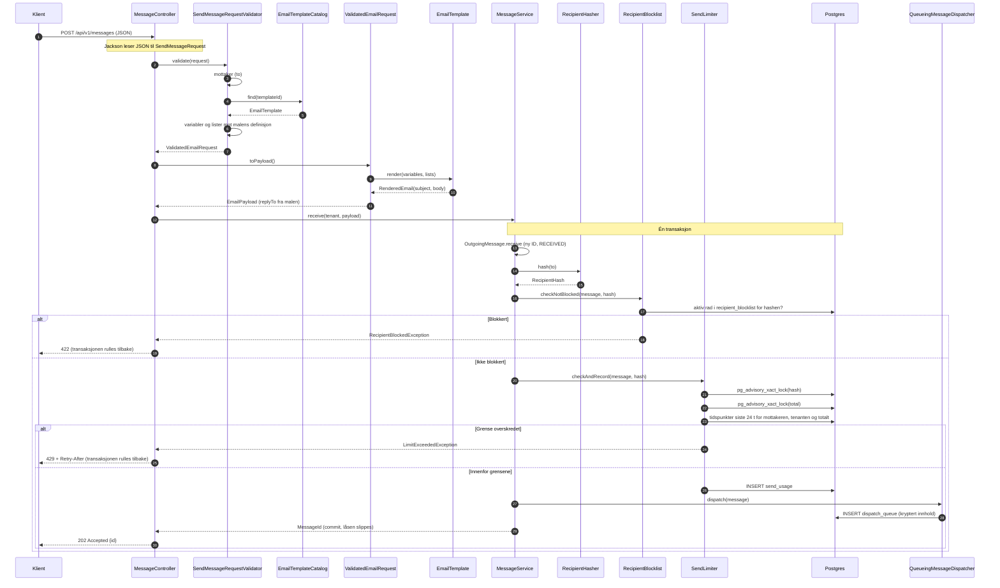

1. Valideringen samler opp alle feil før den eventuelt avviser requesten, så klienten får vite om
   alle ugyldige felt på én gang.
2. Malen rendres mens requesten behandles (synkront), ikke ved utsending. Feil i verdiene blir
   dermed 400 med en gang, og meldingen er uavhengig av senere endringer i malen.
3. Svaret 202 betyr at meldingen er akseptert og lagret i køen, ikke at den er levert. Utsendingen
   skjer asynkront, se [Hva skjer med meldingen etter 202](#hva-skjer-med-meldingen-etter-202).
4. Rekkefølgen er validering → blokkeringsliste → grenser (mottaker → tenant → total) → registrering
   av forbruk → dispatch (INSERT i køen) → 202. En blokkert melding stopper før grensene og teller ikke.
   Forbruket registreres bare når alle grenser passerer, og i samme transaksjon som dispatch: feiler
   dispatch, rulles forbruket tilbake, og en melding som er i køen, er alltid talt med. Kallet til ACS
   skjer etter commit, så grenselåsen holdes ikke mens det sendes. Se [Blokkeringsliste](#blokkeringsliste) og [Grenser](#grenser).

### Hva skjer med meldingen etter 202

`MessageDispatcher` er porten mellom mottak og utsending. `QueueingMessageDispatcher` legger
meldingen i tabellen `dispatch_queue`, i samme transaksjon som forbruket. `DispatchWorker` kjører i
hver pod hvert andre sekund (`communication.dispatch.poll-interval`), reserverer meldinger som er
klare, og sender dem via `EmailAdapter` utenfor transaksjonen.

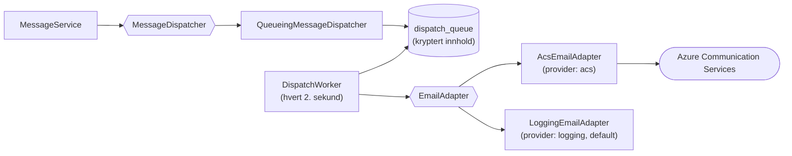

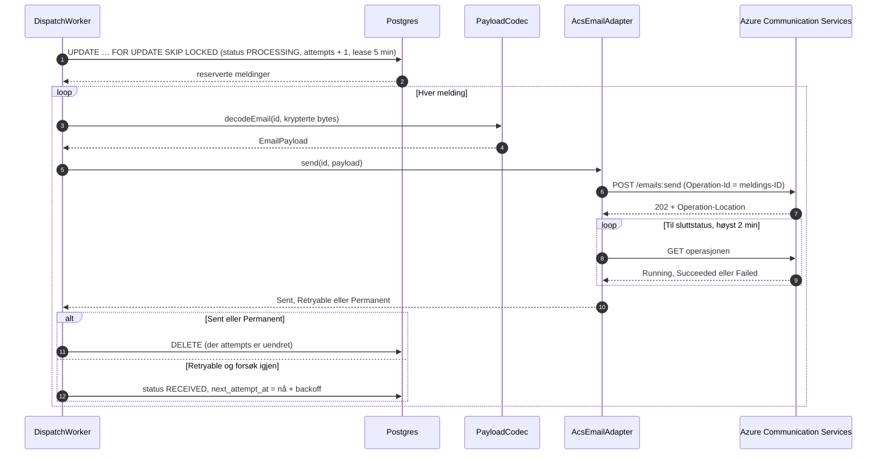

- **Utfall.** Adapteren kaster ikke feil, men returnerer `EmailSendOutcome`: `Sent`,
  `Retryable(årsak, Retry-After)` eller `Permanent(årsak)`. Workeren logger utfallet og teller det.

  | Svar fra ACS                                  | Utfall                      | `reason`           |
  |-----------------------------------------------|-----------------------------|--------------------|
  | Operasjonen `Succeeded`                       | `Sent`                      | –                  |
  | Operasjonen `Failed` eller `Canceled`         | `Permanent`                 | `operation-failed` |
  | 400, 404, 413 og andre 4xx                    | `Permanent`                 | `rejected`         |
  | 401, 403                                      | `Retryable`                 | `unauthorized`     |
  | 408, ingen sluttstatus innen 2 min            | `Retryable`                 | `timeout`          |
  | 429                                           | `Retryable` (`Retry-After`) | `throttled`        |
  | 5xx                                           | `Retryable`                 | `server-error`     |
  | Nettverksfeil                                 | `Retryable`                 | `io`               |
  | Annen feil i adapteren eller ved dekryptering | `Retryable`                 | `unexpected`       |

  401 og 403 regnes som forbigående, siden de skyldes konfig (nøkkel rotert eller feil), og meldingen
  da kan sendes når konfigen er rettet.
- **Retry.** Azure-SDK-et prøver selv tre ganger på nettverksfeil, 408, 429 og 5xx før adapteren får
  svaret. I tillegg prøver workeren på nytt etter 1, 2, 4 … minutter, høyst 1 time mellom forsøkene,
  og høyst 8 forsøk (ca. 2 timer). `Retry-After` fra ACS brukes når den er lengre. Når forsøkene er
  brukt opp, feiler meldingen med `retries-exhausted`.
- **Idempotens.** `OperationIdPolicy` setter HTTP-headeren `Operation-Id` til meldings-ID-en på
  sendingen. Alle forsøk, også SDK-ets egne og forsøk etter en restart, har dermed samme ID hos ACS,
  og leveringsrapportene fra ACS (FFS-2338) kan knyttes til meldingen. ACS dokumenterer ikke hva som
  skjer ved gjentatt `Operation-Id`; det verifiseres i beta (se
  [runbooken](runbook.md#verifisere-utsending)). Til det er bekreftet, kan en melding i verste fall
  bli sendt to ganger hvis ACS sendte den, men svaret ikke kom fram.
- **Restart og flere replikaer.** Reservasjonen er én `UPDATE … WHERE message_id IN (SELECT … FOR
  UPDATE SKIP LOCKED)`, så to replikaer får aldri samme rad. En reservert melding har `locked_until`
  (lease, 5 min). Stopper podden midt i en sending, tas meldingen på nytt når leasen er ute. Leasen
  er lengre enn 2 minutter venting på ACS pluss SDK-ets retry.
- **Sent svar.** Sletting og ny planlegging gjelder bare raden med samme `attempts` som da den ble
  reservert. Et svar som kommer etter at en annen replika har tatt over meldingen, endrer derfor
  ingenting; workeren logger det.
- **Innhold.** `PayloadCodec` serialiserer adresse, emne, innhold og `replyTo` til JSON og krypterer
  det med AES-256-GCM (`PayloadCipher`, tilfeldig nonce per melding). Meldings-ID-en er associated
  data, så krypterte bytes kan ikke flyttes til en annen rad. `tenant`, `channel` og `templateId`
  ligger i klartekst, siden de trengs til logg og metrikker. Nøkkelen er
  `COMMUNICATION_DISPATCH_ENCRYPTION_KEY`.
- **Mapping til ACS.** `senderAddress` fra `communication.email.sender`, `to` som eneste mottaker,
  emnet som `subject`, rendret innhold som `html`, `replyTo` fra malen og
  `userEngagementTrackingDisabled = true`. Ingen `plainText` før FFS-1969.
- **Metrikker.** `DispatchMetrics` teller `communication.message.sent` (`tenant`, `channel`),
  `communication.message.retried` og `communication.message.failed` (begge også `reason`).
  `DispatchQueueMetrics` publiserer `communication.dispatch.queue.size` og
  `communication.dispatch.queue.oldest` (sekunder). Varslene står i [runbooken](runbook.md).
- **Leverandøren `logging`.** Logger meldings-ID og mal og returnerer `Sent`. Default lokalt, i
  tester og i beta til ACS-ressursen finnes (FFS-1965).

Controller og service endres ikke når leverandøren byttes.

### Validering

| Felt                 | Regel                                                                                                                                               |
|----------------------|-----------------------------------------------------------------------------------------------------------------------------------------------------|
| `tenant`             | Påkrevd, én av verdiene i `Tenant` (f.eks. `ROGALAND`). Sjekkes av Jackson; ukjent verdi gir 400 med liste over gyldige verdier.                    |
| `message`            | Påkrevd. Sjekkes av Jackson.                                                                                                                        |
| `message.channel`    | Påkrevd, én av kanalene i `@JsonSubTypes` (i dag `EMAIL`). Sjekkes av Jackson; manglende eller ukjent verdi gir 400 med liste over gyldige verdier. |
| `message.to`         | Påkrevd, én adresse uten visningsnavn, domene med punktum, maks 254 tegn (RFC 5321).                                                                |
| `message.templateId` | Påkrevd, formatet `<team>/<mal>`, malen må finnes.                                                                                                  |
| `message.variables`  | Nøyaktig de variablene malen deklarerer.                                                                                                            |
| `message.lists`      | Nøyaktig de listene malen deklarerer, mellom 1 og `maxItems` elementer.                                                                             |
| Hver verdi           | Ikke blank, ingen linjeskift eller andre kontrolltegn, maks `maxLength` tegn.                                                                       |

## Feilhåndtering

Alle feil returneres som `application/problem+json` (RFC 9457). `GlobalExceptionHandler` arver fra
Springs `ResponseEntityExceptionHandler`, slik at også rammeverkets feil (405, 415 osv.) får samme
format.

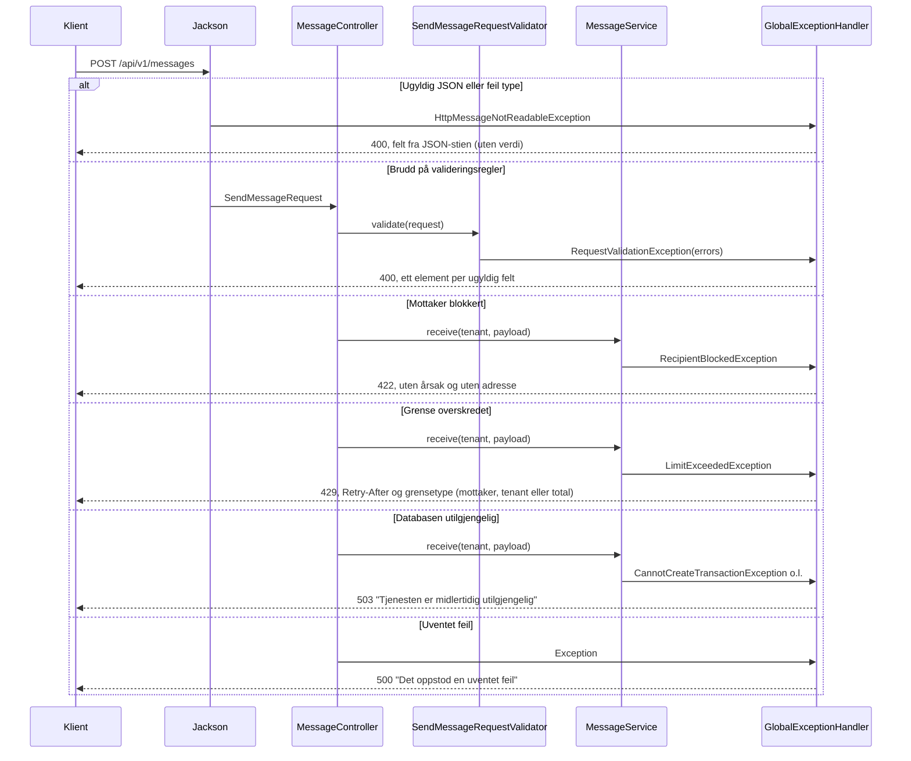

| Status | Når                                                                            | Innhold                                                    |
|--------|--------------------------------------------------------------------------------|------------------------------------------------------------|
| 202    | Requesten er gyldig og meldingen akseptert.                                    | `{"id": "<uuid>"}`                                         |
| 400    | Ugyldig JSON, feil type eller brudd på valideringsregler.                      | `detail` og `errors: [{field, message}]`                   |
| 401    | Mangler eller ugyldig token. **Planlagt** (FFS-1970).                          | ProblemDetail                                              |
| 405    | Annen HTTP-metode enn POST.                                                    | ProblemDetail                                              |
| 415    | Body er ikke `application/json`.                                               | ProblemDetail                                              |
| 422    | Mottakeren er blokkert (opt-out eller hard bounce). Meldingen er ikke lagret.  | ProblemDetail uten årsak og uten adresse                   |
| 429    | En grense for mottaker, tenant eller totalt er nådd. Meldingen er ikke lagret. | ProblemDetail med `limit`, header `Retry-After` i sekunder |
| 500    | Uventet feil.                                                                  | Generell melding; stacktracen logges, men returneres ikke. |
| 503    | Databasen er utilgjengelig eller låsen ble ikke fått på 5 s.                   | Generell melding. Meldingen er ikke akseptert.             |

Eksempel på 400:

```json
{
  "title": "Bad Request",
  "status": 400,
  "detail": "Requesten inneholder ugyldige felt",
  "instance": "/api/v1/messages",
  "errors": [
    { "field": "message.to", "message": "må være én gyldig e-postadresse" },
    { "field": "message.variables.antallFeil", "message": "kan ikke være lengre enn 6 tegn" }
  ]
}
```

Eksempel på 429:

```json
HTTP/1.1 429
Retry-After: 3000

{
  "title": "Too Many Requests",
  "status": 429,
  "detail": "Mottakeren har fått for mange meldinger. Prøv igjen senere.",
  "instance": "/api/v1/messages",
  "limit": "mottaker"
}
```

Eksempel på 422:

```json
{
  "title": "Unprocessable Content",
  "status": 422,
  "detail": "Mottakeren kan ikke motta e-post fra tjenesten.",
  "instance": "/api/v1/messages"
}
```

Svaret er det samme for opt-out og hard bounce, så avsenderen får ikke vite hvorfor mottakeren er
blokkert. Et nytt forsøk gir samme svar.

`detail` i 429 avhenger av grensetypen:

| `limit`    | `detail`                                                    |
|------------|-------------------------------------------------------------|
| `mottaker` | Mottakeren har fått for mange meldinger. Prøv igjen senere. |
| `tenant`   | Tenanten har sendt for mange meldinger. Prøv igjen senere.  |
| `total`    | Tjenesten har sendt for mange meldinger. Prøv igjen senere. |

503 gis for `CannotCreateTransactionException`, `DataAccessResourceFailureException` og
`PessimisticLockingFailureException` (lock timeout; `SendUsageRepository` oversetter Postgres'
`lock_not_available` til `CannotAcquireLockException`, siden Spring ikke gjør det selv), og for
`TransactionSystemException` når rollback feilet fordi forbindelsen er brutt. Andre databasefeil er
bugs og blir 500.

En feil som oppstår i rendering eller domene etter at valideringen har godkjent requesten, er en bug
og blir 500.

## Malsystemet

All e-post sendes via en mal. Klienter kan ikke sende fritekst. Det reduserer risikoen for at
personopplysninger havner i e-post ved en feil, og gjør at alt innhold som sendes, er gjennomgått i
en PR.

### Struktur på disk

```
app/src/main/resources/templates/
└── <team>/
    └── email/
        └── <mal>/
            ├── template.yaml
            └── body.html
```

- Mal-ID-en er `<team>/<mal>`. Kanalen ligger i stien og bestemmes i requesten av `message.channel`:
  en `EMAIL`-melding slår bare opp blant e-postmalene.
- Hvert team eier sin mappe via `.github/CODEOWNERS`. Nye maler og endringer godkjennes i PR.
- Endring av en mal krever ny deploy.

`template.yaml`:

```yaml
description: Periodisk oppsummering av feil på integrasjoner i Flyt.
subject: "Flyt: {{antallFeil}} feil på integrasjoner"
replyTo: no-reply@novari.no     # valgfri
variables:
  antallFeil: { maxLength: 6 }
lists:
  integrasjoner:
    maxItems: 100
    fields:
      navn: { maxLength: 100 }
      antallFeil: { maxLength: 6 }
```

`body.html` inneholder bare innholdet i Mustache. Layout rundt innholdet legges på sentralt
(**planlagt**, FFS-1969).

### Lasting ved oppstart

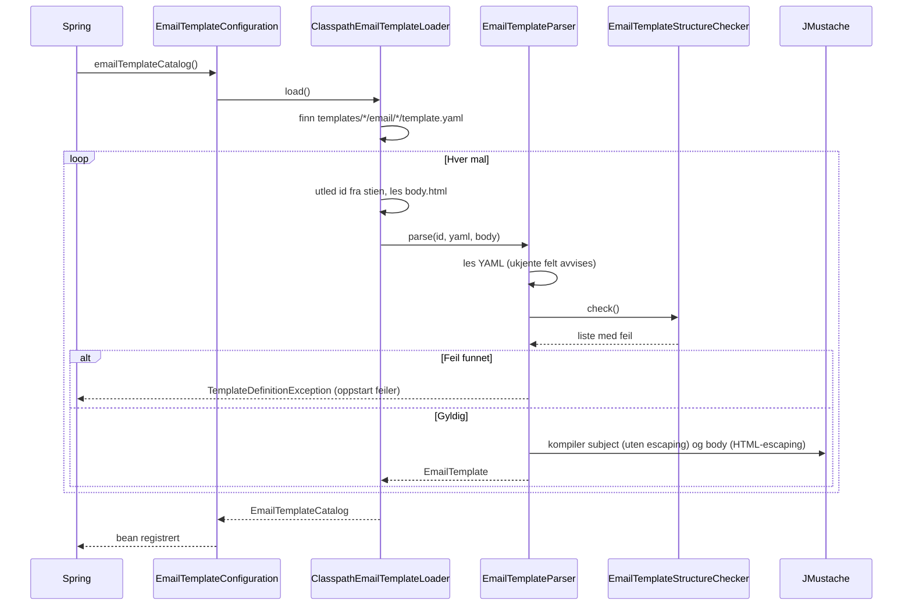

En ugyldig mal stopper oppstarten. Testen `all production templates are valid` gjør den samme
kontrollen, så feilen oppdages i CI før deploy.

### Regler for maler

Kontrollen gjøres av `EmailTemplateStructureChecker` med en egen gjennomgang av Mustache-taggene.

| Regel                                                                                                      | Hvorfor                                                     |
|------------------------------------------------------------------------------------------------------------|-------------------------------------------------------------|
| Variabler er påkrevde strenger med `maxLength` mellom 1 og 1000.                                           | Ingen variabel kan i praksis gjøre malen til fritekst.      |
| Lister har `maxItems` mellom 1 og 100 og minst ett felt.                                                   | Øvre grense for innhold kan regnes ut og ses i review.      |
| Lister brukes bare som section, og inne i en liste bare listens egne felt.                                 | Valideringen av requesten blir eksakt.                      |
| Alt som er deklarert, brukes, og alt som brukes, er deklarert.                                             | Malen og definisjonen kan ikke komme ut av takt.            |
| Ikke tillatt: `{{{ }}}`, `{{& }}`, inverterte sections, partials, nøstede sections, endring av delimitere. | Alle verdier escapes, og strukturen er enkel å kontrollere. |
| `subject` er én linje uten sections.                                                                       | Emnet er ren tekst.                                         |
| `replyTo` er en gyldig adresse hvis den er satt.                                                           |                                                             |
| Navn har formen `antallFeil` (bokstav først, deretter bokstaver og tall).                                  | Unngår JMustaches spesialsyntaks (`a.b`, `-first`).         |

### Rendering

JMustache brukes direkte (ikke `spring-boot-starter-mustache`, som også setter opp
MVC-visninger).

| Del         | Escaping | Konsekvens                                                                              |
|-------------|----------|-----------------------------------------------------------------------------------------|
| `body.html` | HTML     | `<script>` i en verdi blir `&lt;script&gt;`.                                            |
| `subject`   | Ingen    | Emnet er ren tekst. Linjeskift er umulig fordi verdier ikke kan inneholde kontrolltegn. |

Lister rendres ved at blokken mellom `{{#liste}}` og `{{/liste}}` gjentas for hvert element:

```html
{{#integrasjoner}}
<tr><td>{{navn}}</td><td>{{antallFeil}}</td></tr>
{{/integrasjoner}}
```

## Meldingsstatus

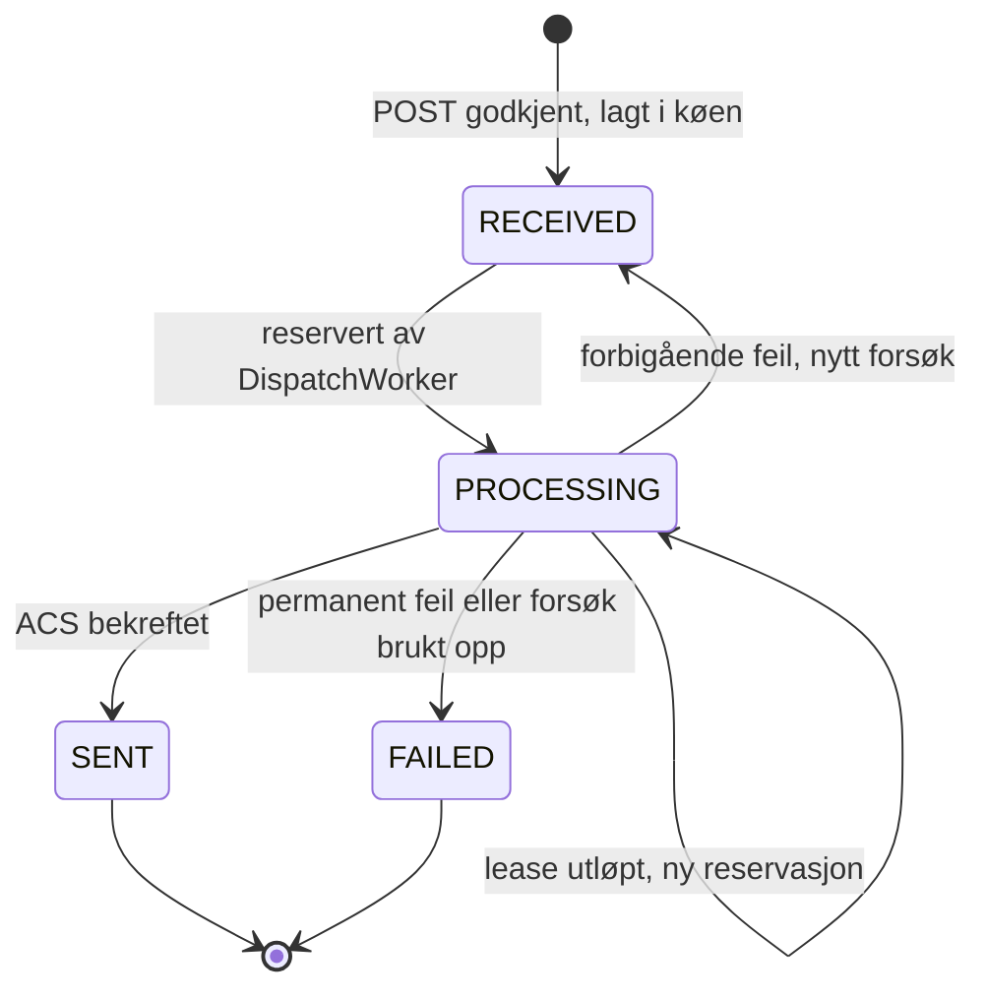

`RECEIVED` og `PROCESSING` er kolonnen `status` i `dispatch_queue`. `SENT` og `FAILED` er
sluttstatus: raden slettes, og utfallet finnes bare i loggen (`Melding sendt` / `Melding feilet`) og i
metrikkene. Status per meldings-ID som konsumenten kan slå opp, kommer i FFS-2337. En melding som har
feilet, prøves ikke på nytt av tjenesten; konsumenten må sende den på nytt.

## Database

Tjenesten har en egen Postgres-database, `fint-common`, som Flais setter opp fra `spec.database` i
`flais.yaml`. Tabeller som gjelder én tenant får `tenant_id`.

| Del        | Løsning                                                                                                                                                                                                                                                                             |
|------------|-------------------------------------------------------------------------------------------------------------------------------------------------------------------------------------------------------------------------------------------------------------------------------------|
| Tilgang    | Spring Data JDBC. Egen SQL skrives med `JdbcClient`.                                                                                                                                                                                                                                |
| Skjema     | Flyway, `classpath:db/migration`, kjøres ved oppstart. `V1__baseline` er tom.                                                                                                                                                                                                       |
| Tabeller   | `send_usage` (`V2`, indeks per tenant i `V3`): forbruk for grensene. `recipient_blocklist` (`V4`): blokkeringslisten. `dispatch_queue` (`V5`): meldinger som venter på å bli sendt.                                                                                                 |
| Readiness  | `db` er med i readiness-gruppen; podden tas ut av trafikk når databasen ikke svarer.                                                                                                                                                                                                |
| Opprydning | `RetentionCleanupJob` kjører kl. 03.15 (Europe/Oslo) og kaller hver `ExpiredRowsCleaner`.                                                                                                                                                                                           |
| Retensjon  | Metadata om meldinger beholdes i 60 dager (`communication.retention.metadata`). `send_usage` beholdes i 24 timer. Utløpte blokkeringer slettes ved neste opprydning; `OPT_OUT` slettes aldri automatisk. En rad i `dispatch_queue` slettes når meldingen er sendt eller har feilet. |

Planlagte tabeller:

| Oppgave  | Innhold                                                                                                          |
|----------|------------------------------------------------------------------------------------------------------------------|
| FFS-2337 | `message`-tabellen med status. `dispatch_queue` er en arbeidskø, ikke statuslager, og kan beholdes ved siden av. |

### Utsendingskø

`dispatch_queue` (`V5`) har én rad per akseptert melding som ikke er sendt eller har feilet ennå:

| Kolonne                            | Innhold                                                                           |
|------------------------------------|-----------------------------------------------------------------------------------|
| `message_id`                       | Meldings-ID (primærnøkkel). Også `Operation-Id` mot ACS.                          |
| `tenant`, `channel`, `template_id` | Enum-navn og mal-ID, til logg og metrikker.                                       |
| `status`                           | `RECEIVED` eller `PROCESSING` (CHECK).                                            |
| `attempts`                         | Antall reservasjoner. Skiller et forsøk fra et senere forsøk på en annen replika. |
| `next_attempt_at`                  | Når meldingen tidligst kan sendes (mottakstidspunktet, eller etter backoff).      |
| `locked_until`                     | Slutten på leasen for en reservert melding.                                       |
| `received_at`                      | Mottakstidspunktet, fra `Clock`. Gir alderen på køen.                             |
| `payload`                          | Adresse, emne, innhold og `replyTo`, kryptert med AES-256-GCM (`bytea`).          |

Indeksen `dispatch_queue_next_attempt_at` brukes når workeren finner meldinger som er klare.
`DispatchQueueMetrics` teller radene og finner den eldste hvert minutt
(`communication.dispatch.queue-metrics-refresh`).

### Mottaker-hashing

Mottakeradresser lagres aldri i klartekst. `RecipientHasher` normaliserer adressen (`trim`,
`lowercase`) og beregner HMAC-SHA256 med en hemmelig nøkkel. Resultatet (`RecipientHash`) er 64
hex-tegn og brukes som nøkkel i tabellene som trenger å kjenne igjen en mottaker.

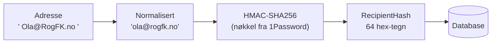

| Egenskap         | Verdi                                                                                    |
|------------------|------------------------------------------------------------------------------------------|
| Nøkkel           | `COMMUNICATION_RECIPIENT_HASHING_KEY`, base64, minst 32 bytes. Fra 1Password-operatoren. |
| Mangler nøkkelen | Oppstarten feiler med en melding som nevner variabelnavnet, aldri verdien.               |
| Logging          | Verken nøkkel, adresse eller hash logges. `toString()` maskerer.                         |
| Nøkkelrotasjon   | Ikke støttet. Se under.                                                                  |

Hashen kan ikke regnes om uten klartekstadressen, som tjenesten ikke har. Et nøkkelbytte gjør
derfor alle lagrede hasher ugjenkjennelige. Tellerne (FFS-2333/2334) lever bare i timer eller dager
og tåler det. Blokkeringslisten tåler det ikke: etter et bytte er ingen mottakere lenger blokkert.
Hard bounces bygges opp igjen når ACS rapporterer dem på nytt (FFS-2338), mens opt-outs må
registreres på nytt fra kilden, siden tjenesten ikke har adressene. Tabellen har derfor ingen
`key_id`; en `key_id` alene hjelper ikke uten oppslag med flere nøkler. Blir rotasjon aktuelt, må
blokkeringslisten få `key_id` og oppslag med både gammel og ny nøkkel.

### Grenser

Grensene er et sikkerhetsnett over konsumentenes egne grenser. Grensen per mottaker beskytter
mottakeren mot spam. Grensene per tenant og totalt skal stoppe en kompromittert eller feilkonfigurert
avsender og holde kostnaden under kontroll. Verdiene ligger i `application.yaml` og endres med PR og
deploy.

| Grense       | Konfig                                         | Verdi | Vindu (glidende) | Status         |
|--------------|------------------------------------------------|-------|------------------|----------------|
| Per mottaker | `communication.limits.recipient.per-hour`      | 10    | Siste 60 min     | Avgjort        |
| Per mottaker | `communication.limits.recipient.per-day`       | 40    | Siste 24 t       | Avgjort        |
| Per tenant   | `communication.limits.tenant.default.per-hour` | 100   | Siste 60 min     | Ikke bekreftet |
| Per tenant   | `communication.limits.tenant.default.per-day`  | 500   | Siste 24 t       | Ikke bekreftet |
| Totalt       | `communication.limits.total.per-hour`          | 500   | Siste 60 min     | Ikke bekreftet |
| Totalt       | `communication.limits.total.per-day`           | 2000  | Siste 24 t       | Ikke bekreftet |

Verdiene for tenant og totalt er foreslåtte startverdier uten trafikktall og må bekreftes med
PO/Flais før produksjon.

En tenant kan få egne grenser under `communication.limits.tenant.overrides.<TENANT>`, der nøkkelen er
enum-navnet i `Tenant`. Tenanter uten override bruker `default`. I dag har ingen tenant override, heller
ikke NOVARI (test).

```yaml
communication:
  limits:
    tenant:
      default:
        per-hour: 100
        per-day: 500
      overrides:
        ROGALAND:
          per-hour: 200
          per-day: 1000
```

Oppstarten stopper ved ugyldig konfig:

- en grense som ikke er positiv, eller `per-day` lavere enn `per-hour`;
- en tenantgrense (`default` eller override) som er høyere enn totalgrensen, siden den da aldri ville
  slått inn;
- en override for en ukjent tenant, eller med bare ett av `per-hour` og `per-day`.

En tenantgrense lavere enn mottakergrensen er tillatt.

`send_usage` har én rad per akseptert melding:

| Kolonne          | Innhold                                                               |
|------------------|-----------------------------------------------------------------------|
| `message_id`     | Meldings-ID (primærnøkkel).                                           |
| `recipient_hash` | `RecipientHash`. Global, så alle tenants deler teller.                |
| `tenant`         | Enum-navnet. Grensen per tenant teller på denne.                      |
| `sent_at`        | Tidspunkt fra `Clock`, lest etter at låsene er tatt (se Samtidighet). |

| Indeks                                                     | Brukes av                     |
|------------------------------------------------------------|-------------------------------|
| `send_usage_recipient_sent_at` (`recipient_hash, sent_at`) | Grensen per mottaker.         |
| `send_usage_tenant_sent_at` (`tenant, sent_at`, `V3`)      | Grensen per tenant.           |
| `send_usage_sent_at` (`sent_at`)                           | Totalgrensen og opprydningen. |

- **Rekkefølge.** Mottaker → tenant → total. Alle tre telles, og forbruket registreres bare når
  ingen er brutt.
- **Samtidighet.** `DatabaseSendLimiter` tar først `pg_advisory_xact_lock` på de første 64 bitene av
  hashen, så en global lås (`pg_advisory_xact_lock(1, 0)`, et eget nøkkelrom som ikke kan kollidere
  med mottakernøklene). Den globale låsen gjør at alle innsendinger, også fra flere pods, går etter
  hverandre, og dekker dermed både tenant- og totalgrensen; en egen lås per tenant ville ikke gitt
  noe ekstra. Ved noen hundre meldinger i timen og en kort transaksjon koster det ingenting. Låsene
  tas alltid i samme rekkefølge, så det kan ikke oppstå vranglås. De slippes ved commit eller
  rollback, og venter høyst 5 sekunder (`lock_timeout`, gir 503). Tidspunktet som brukes til
  vinduene og lagres i `sent_at`, leses først når låsene er tatt, ikke `receivedAt`. Ellers kunne en
  forespørsel som ventet på en lås, bli avvist for forbruk som allerede hadde gått ut av vinduet,
  eller bli registrert for tidlig, slik at neste melding slapp gjennom før det var gått et helt vindu.
- **Retry-After.** For hvert vindu som er brutt, er neste ledige tidspunkt når raden nummer
  `antall − grense` (eldste først) faller ut av vinduet. Er flere grenser brutt, får svaret grensen
  med lengst ventetid, slik at `limit` og `Retry-After` stemmer overens; ved likhet vinner den første
  i rekkefølgen. Svaret er i hele sekunder rundet opp, minst 1.
- **Transaksjon.** Låser, telling, registrering og dispatch (INSERT i `dispatch_queue`) skjer i samme
  transaksjon (`MessageService.receive`). En avvist melding etterlater ingen rad, verken i
  `send_usage` eller i køen. Kallet til ACS skjer etter commit og holder ikke låsene.
- **Opprydning.** `SendUsageCleaner` sletter rader eldre enn 24 timer.
- **Metrikker.** `DatabaseSendLimiter` øker `communication.limit.rejected` (tagger `limit` og `tenant`)
  ved hver 429. `MessageMetrics` øker `communication.message.accepted` (tagger `tenant` og `channel`)
  når transaksjonen er committet, via en `@TransactionalEventListener` på `MessageAccepted`, så en
  melding som rulles tilbake, ikke telles. `LimitUsageMetrics` regner ut utnyttelsen (forbruk delt på
  grense) per tenant og totalt for hvert vindu med én `GROUP BY tenant`-spørring mot `send_usage` hvert
  minutt, og publiserer den som `communication.limit.tenant.usage` (`tenant`, `window`) og
  `communication.limit.total.usage` (`window`). Varslene er beskrevet i [runbooken](runbook.md).

| Metrikk (Prometheus)                     | Type    | Tagger                                            |
|------------------------------------------|---------|---------------------------------------------------|
| `communication_limit_rejected_total`     | Counter | `limit` (`mottaker`, `tenant`, `total`), `tenant` |
| `communication_message_accepted_total`   | Counter | `tenant`, `channel`                               |
| `communication_limit_tenant_usage_ratio` | Gauge   | `tenant`, `window` (`hour`, `day`)                |
| `communication_limit_total_usage_ratio`  | Gauge   | `window` (`hour`, `day`)                          |

Utnyttelsen kan ligge opptil ett minutt etter (`communication.limits.usage-refresh`). Alle tenants
rapporteres, også de uten forbruk. Med flere replikaer rapporterer alle samme verdi, så spørringer i
Grafana og varsler bruker `max`. Det finnes ingen gauge for mottakergrensen, siden den ville trengt én
serie per mottaker; avvisningene der telles med `limit="mottaker"`.

### Blokkeringsliste

Mottakere som har meldt seg av (`OPT_OUT`) eller hard-bouncet (`HARD_BOUNCE`), skal ikke få e-post.
Listen er global (på tvers av tenants) og lagrer bare `RecipientHash`.

| Årsak         | Utløp (`expires_at`)        | Legges inn av                                      |
|---------------|-----------------------------|----------------------------------------------------|
| `OPT_OUT`     | Ingen. Fjernes manuelt.     | Driftsrutinen (SQL). Avmeldingslenke: FFS-2340.    |
| `HARD_BOUNCE` | 30 dager etter siste bounce | Driftsrutinen (SQL). Automatisk fra ACS: FFS-2338. |

`recipient_blocklist` (`V4`):

| Kolonne          | Innhold                                                       |
|------------------|---------------------------------------------------------------|
| `recipient_hash` | `RecipientHash`. Del av primærnøkkelen.                       |
| `reason`         | `OPT_OUT` eller `HARD_BOUNCE` (CHECK). Del av primærnøkkelen. |
| `source`         | `MANUAL` (driftsrutinen) eller `ACS` (FFS-2338) (CHECK).      |
| `created_at`     | Når raden ble lagt inn (`now()` som default).                 |
| `expires_at`     | `NULL` for `OPT_OUT`, påkrevd for `HARD_BOUNCE` (CHECK).      |

| Indeks                                                                | Brukes av                                           |
|-----------------------------------------------------------------------|-----------------------------------------------------|
| `recipient_blocklist_pkey` (`recipient_hash, reason`)                 | Oppslaget ved innsending og upsert i driftsrutinen. |
| `recipient_blocklist_expires_at` (`expires_at`, bare rader med utløp) | Opprydningen.                                       |

- **Én rad per hash og årsak.** Opt-out og hard bounce lever uavhengig av hverandre: fjernes en
  opt-out, står en aktiv hard bounce igjen, og en ny hard bounce kan ikke gjøre en opt-out
  midlertidig. En ny `OPT_OUT` på en hash som har det fra før, gjør ingenting
  (`ON CONFLICT DO NOTHING`). En ny `HARD_BOUNCE` setter `expires_at` til den seneste av gammel og
  ny verdi, så en blokkering forlenges, men aldri forkortes.
- **Oppslag.** `DatabaseRecipientBlocklist` spør om det finnes en rad for hashen med
  `expires_at IS NULL` eller `expires_at > now`, der `now` er mottakstidspunktet fra `Clock`. Utløpte
  rader ignoreres. Oppslaget skjer i transaksjonen til `MessageService.receive`, før grenselåsene.
- **Avvisning.** Blokkert gir `RecipientBlockedException` og `422`. Transaksjonen rulles tilbake, så
  meldingen verken lagres eller teller mot grensene. Svaret og loggen har ikke årsaken.
- **Metrikk.** Telleren `communication.blocklist.rejected` øker for hver avvisning, med `tenant` som
  eneste tag. Den scrapes av Prometheus som `communication_blocklist_rejected_total`. Varselet og hva
  vakthavende gjør står i [runbooken](runbook.md#mange-blokkerte-innsendinger).
- **Opprydning.** `BlocklistCleaner` sletter rader med `expires_at <= now` i den nattlige
  opprydningen. `OPT_OUT` har ikke utløp og slettes aldri automatisk.
- **Fail-closed.** Er databasen utilgjengelig, blir det `503`, som for grensene.

#### Driftsrutine

Opt-out legges inn og blokkeringer fjernes med SQL mot `fint-common`; se README for SQL-en. Hashen
beregnes med `RecipientHashCli`, en `main` i `recipient` som bruker `RecipientHasher` og leser
nøkkelen fra `COMMUNICATION_RECIPIENT_HASHING_KEY`. Den kjøres i podden:

```bash
kubectl exec -i -n fintlabs-no deploy/fint-communication-service -- java -Xmx64m -cp /app/app.jar -Dloader.main=no.novari.communication.recipient.RecipientHashCliKt org.springframework.boot.loader.launch.PropertiesLauncher < adresser.txt
```

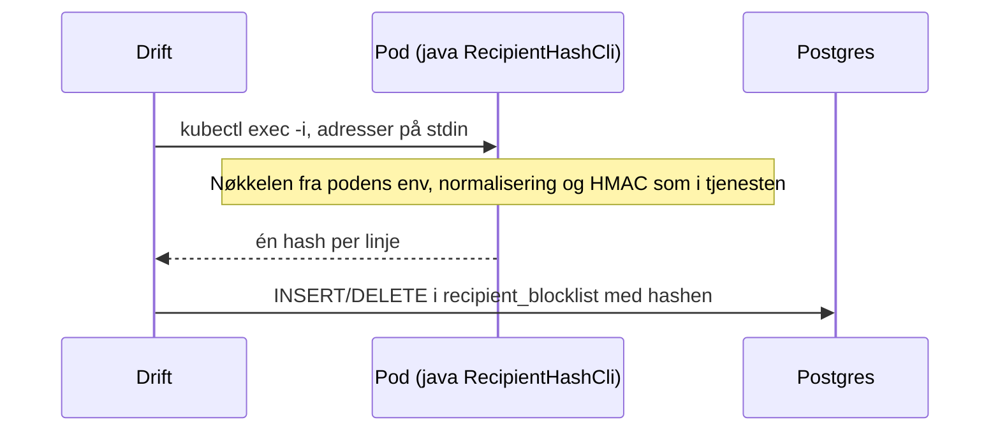

- Imaget (distroless) har ikke shell, men `kubectl exec` starter `java` direkte, og `PropertiesLauncher`
  med `loader.main` kjører en annen `main` fra den samme jar-filen uten å starte Spring.
- Nøkkelen forlater aldri clusteret, og drift trenger ikke tilgang til 1Password-itemet.
- Adressene leses fra stdin, ikke som argumenter, så de havner ikke i shell-historikken eller
  prosesslisten. Verktøyet skriver bare hashen; mangler nøkkelen, skrives samme feilmelding som ved
  oppstart (med variabelnavnet, aldri verdien), og exit-koden er 1.
- `-Xmx64m` er nødvendig fordi JVM-en deler containerens minnegrense med tjenesten og ellers ville
  arvet `MaxRAMPercentage=60` fra `JAVA_TOOL_OPTIONS`.

## Personvern og logging

Mottaker, emne, innhold og variabelverdier kan inneholde personopplysninger.

| Tiltak                                                                                                                                                                                      | Hvor                                                                            |
|---------------------------------------------------------------------------------------------------------------------------------------------------------------------------------------------|---------------------------------------------------------------------------------|
| Klienter kan ikke sende fritekst; alt innhold kommer fra gjennomgåtte maler.                                                                                                                | Malsystemet                                                                     |
| `toString()` maskerer mottaker, emne, innhold og verdier.                                                                                                                                   | `EmailMessage`, `EmailPayload`, `RenderedEmail`                                 |
| Feilmeldinger gjentar aldri innsendte verdier. Navn tas bare med når de har formen til et variabelnavn.                                                                                     | `SendMessageRequestValidator`                                                   |
| Jacksons feilmeldinger, som kan sitere verdier, brukes ikke i respons eller logg; bare JSON-stien.                                                                                          | `GlobalExceptionHandler`                                                        |
| Loggen ved mottak inneholder bare `id`, `tenant`, `channel` og `templateId`.                                                                                                                | `QueueingMessageDispatcher`                                                     |
| Mottakere lagres bare som HMAC-hash. Nøkkel, adresse og hash logges aldri.                                                                                                                  | `RecipientHasher`                                                               |
| 429-svaret og WARN-loggen har bare grensetype, `tenant` og meldings-ID, aldri adresse eller hash.                                                                                           | `GlobalExceptionHandler`                                                        |
| 422-svaret og WARN-loggen har bare `tenant` og meldings-ID, verken årsak, adresse eller hash.                                                                                               | `GlobalExceptionHandler`                                                        |
| Telleren for blokkerte innsendinger har bare `tenant` som tag.                                                                                                                              | `DatabaseRecipientBlocklist`                                                    |
| Tellerne og gaugene for grensene, aksepterte og sendte meldinger og køen har bare enum-verdier som tagger (`limit`, `tenant`, `channel`, `window`, `reason`).                               | `DatabaseSendLimiter`, `MessageMetrics`, `LimitUsageMetrics`, `DispatchMetrics` |
| JSON-loggen har de samme meldingene som før og ingen MDC-felt; en test sjekker formatet og at adressen ikke er med.                                                                         | `StructuredLoggingTest`                                                         |
| Innholdet i køen er kryptert med AES-256-GCM og en egen nøkkel; bare `tenant`, `channel` og `templateId` er i klartekst.                                                                    | `PayloadCodec`, `PayloadCipher`                                                 |
| Utsendingsloggen har meldings-ID, status, tenant, kanal, mal, antall forsøk, årsak og HTTP-status eller ACS-feilkode, aldri feilmeldingen fra ACS.                                          | `DispatchWorker`, `AcsEmailAdapter`                                             |
| Azure-SDK-ets egen logging er slått av (`logging.level.com.azure: off`), og HTTP-loggingen er `NONE`; svarene fra ACS kan sitere adressen.                                                  | `application.yaml`, `AcsEmailAdapter`                                           |
| Connection string og nøkler vises aldri i oppstartsfeil eller `toString()`.                                                                                                                 | `EmailConfiguration`, `AcsProperties`, `DispatchProperties`                     |
| En test sender via det ekte Azure-SDK-et mot en falsk ACS som siterer adressen, emnet og nøkkelen i feilsvarene, og sjekker logg og metrikk-tagger.                                         | `AcsLoggingPrivacyTest`                                                         |
| Driftsverktøyet leser adresser fra stdin og skriver bare hashen. Nøkkelen blir i podden.                                                                                                    | `RecipientHashCli`                                                              |
| En test sjekker at adressen ikke finnes i logg, i noen tekst- eller binærkolonne i databasen (også `recipient_blocklist` og `dispatch_queue`), i metrikk-tagger eller i Prometheus-scrapen. | `RecipientPrivacyTest`                                                          |

`replyTo` kommer fra malen og er en Novari-adresse, så den vises umaskert.

## Drift

| Egenskap         | Verdi                                                                                                                                                                                                                                                                     |
|------------------|---------------------------------------------------------------------------------------------------------------------------------------------------------------------------------------------------------------------------------------------------------------------------|
| Image            | `ghcr.io/fintlabs/fint-communication-service`, distroless Java 25                                                                                                                                                                                                         |
| Namespace        | `fintlabs-no` (én deployment for alle tenants)                                                                                                                                                                                                                            |
| Eksponering      | Bare intern i clusteret (ingen ingress)                                                                                                                                                                                                                                   |
| Port             | 8080                                                                                                                                                                                                                                                                      |
| Probes           | `/actuator/health` (startup), `/actuator/health/liveness`, `/actuator/health/readiness`                                                                                                                                                                                   |
| Logging          | JSON (Spring Boots `logstash`-format) til stdout, satt i `application.yaml`. Samles inn av Loki.                                                                                                                                                                          |
| Log-nivå         | `logging.level.<pakke>` som env i flais.yaml eller overlay, f.eks. `logging.level.no.novari.communication=DEBUG`.                                                                                                                                                         |
| Metrikker        | `/actuator/metrics` og `/actuator/prometheus` på port 8080. Flais lager en PodMonitor fra `spec.observability.metrics`. Metrikkene for grenser og blokkeringsliste er beskrevet i [runbooken](runbook.md#metrikker).                                                      |
| Dashboard        | `grafana/fint-communication-service.json`, importeres manuelt i Grafana.                                                                                                                                                                                                  |
| Varsling         | Metrikker, terskler og varighet står i [runbooken](runbook.md#varselregler). Reglene registreres manuelt i Grafana Alerts.                                                                                                                                                |
| Ressurser        | 256–512 Mi minne, 50–500m CPU, 1 replika                                                                                                                                                                                                                                  |
| Database         | Postgres `fint-common` via Flais (`spec.database`). Readiness inkluderer `db`.                                                                                                                                                                                            |
| Hemmeligheter    | 1Password-item via `spec.onePassword.itemPath` (beta: `vaults/aks-beta-vault/items/fint-communication-service`), med `COMMUNICATION_RECIPIENT_HASHING_KEY`, `COMMUNICATION_DISPATCH_ENCRYPTION_KEY` og, når ACS er slått på, `COMMUNICATION_EMAIL_ACS_CONNECTION_STRING`. |
| E-postleverandør | `communication.email.provider`: `logging` (default, også i beta til FFS-1965) eller `acs` med `communication.email.sender`. Se README for hvordan ACS slås på.                                                                                                            |
| Miljøer          | beta (`aks-beta-fint-2021-11-23`). Produksjon (`api`) er ikke satt opp.                                                                                                                                                                                                   |
| Bygg/deploy      | Push til `main` bygger image og deployer til beta (GitHub Actions).                                                                                                                                                                                                       |

All tilstand ligger i databasen, så API-applikasjonen kan skaleres horisontalt. Opprydningsjobben
kjører da på hver replika; slettingene er idempotente, så det gjør ingen skade. `DispatchWorker` kjører
også på hver replika, og `SKIP LOCKED` fordeler meldingene mellom dem.

## Videre utvikling

| Oppgave  | Innhold                                                                                                                               |
|----------|---------------------------------------------------------------------------------------------------------------------------------------|
| FFS-1969 | Sentral layout rundt rendret innhold, `text/plain`-variant (`plainText` til ACS), HTML-regler for maler.                              |
| FFS-1970 | Bearer-token fra NAM (Spring Security), 401 som ProblemDetail.                                                                        |
| FFS-2337 | Meldingsstatus per `MessageId`, også `SENT` og `FAILED` som i dag bare logges.                                                        |
| FFS-2338 | Leveringsrapporter fra ACS, knyttet til meldingen via `Operation-Id`; hard bounce skrives til blokkeringslisten med `source = 'ACS'`. |
| FFS-2340 | Avklaring av avmeldingslenke/admin-API for opt-out.                                                                                   |
| FFS-1965 | ACS-ressurs, domene og avsenderadresse; deretter `communication.email.provider=acs` i beta.                                           |
| Fase 6   | Kafka som sekundær inngang, med samme validering og mottak som REST.                                                                  |

## Sentrale beslutninger

| Beslutning                                                                                                          | Begrunnelse                                                                                                                                                     |
|---------------------------------------------------------------------------------------------------------------------|-----------------------------------------------------------------------------------------------------------------------------------------------------------------|
| All e-post sendes via mal; ingen fritekst.                                                                          | Begrenser risikoen for personopplysninger i e-post; alt innhold gjennomgås i PR.                                                                                |
| Maler er knyttet til kanal (`<team>/<kanal>/<mal>`).                                                                | Formatene er forskjellige per kanal; egne typer per kanal i koden.                                                                                              |
| Team først i stien.                                                                                                 | Én CODEOWNERS-linje per team.                                                                                                                                   |
| Variabler er strenger; lister er typet med `maxItems` og felt.                                                      | Øvre grense for innhold kan regnes ut; tall og datoer formateres av klienten.                                                                                   |
| `replyTo` defineres i malen, ikke i requesten.                                                                      | Ingen risiko for personlige adresser som svaradresse.                                                                                                           |
| Polymorf kontrakt (`{tenant, message: {channel, ...}}`) med sealed `Message`.                                       | Nøyaktig én melding følger av typen; nye kanaler er nye subtyper uten brudd i kontrakten.                                                                       |
| Malen rendres ved mottak.                                                                                           | Feil blir 400 med en gang; meldingen er uavhengig av senere malendringer.                                                                                       |
| ProblemDetail (RFC 9457) for alle feil.                                                                             | Standardformat, støttet direkte av Spring.                                                                                                                      |
| JMustache direkte, egen kontroll av taggene.                                                                        | Logic-less maler; reglene kan håndheves ved oppstart.                                                                                                           |
| Port (`MessageDispatcher`) mellom mottak og leveranse, og port (`EmailAdapter`) mot leverandøren.                   | Leveransen og leverandøren kan byttes ut uten å endre API eller service.                                                                                        |
| `model` uten avhengigheter ved kjøring (bare `compileOnly` `jackson-annotations`), `client` uten autokonfigurasjon. | Bibliotekene kan brukes i alle Spring Boot 3- og 4-applikasjoner (Jackson 2 og 3).                                                                              |
| Spring Data JDBC, ikke JPA.                                                                                         | Immutable Kotlin-klasser uten proxies. Tellere (`INSERT … ON CONFLICT`) og opprydning er native SQL uansett.                                                    |
| Mottakere lagres som HMAC-SHA256 med hemmelig nøkkel, ikke ren SHA-256.                                             | E-postadresser er lette å gjette; uten nøkkelen kan hashen ikke slås opp mot en liste med adresser.                                                             |
| Ingen nøkkelrotasjon og ingen `key_id` i blokkeringslisten.                                                         | Et nøkkelbytte krever at blokkeringslisten bygges opp på nytt. `key_id` alene hjelper ikke uten oppslag med flere nøkler, og kan legges til med en migrering.   |
| Opprydning uten ShedLock.                                                                                           | Slettingene er idempotente; samtidige kjøringer på flere replikaer gjør ingen skade.                                                                            |
| Grenser med `pg_advisory_xact_lock` på mottaker-hashen og en global lås.                                            | Atomisk på tvers av pods uten retry-logikk eller egen låsetabell.                                                                                               |
| Én rad per akseptert melding i `send_usage`, ikke aggregerte bøtter.                                                | Ekte glidende vindu og eksakt `Retry-After`; få rader ved disse volumene.                                                                                       |
| Forbruk og dispatch (INSERT i køen) i samme transaksjon.                                                            | En melding som ikke ble akseptert, teller ikke, så klientens nye forsøk straffes ikke, og en melding i køen er alltid talt med.                                 |
| Fail-closed: databasen utilgjengelig gir 503.                                                                       | Grensene kan ikke omgås ved at databasen er nede.                                                                                                               |
| Override per tenant må ha både `per-hour` og `per-day`, og ingen tenantgrense kan overstige totalgrensen.           | Ingen fletting med `default` å holde rede på; en tenantgrense over totalen ville aldri slått inn og er trolig en feil.                                          |
| Én global advisory lock (etter mottakerlåsen) i stedet for egen lås per tenant.                                     | Totalgrensen krever at alle innsendinger serialiseres; ved noen hundre meldinger i timen koster det ingenting.                                                  |
| Ved flere brudde grenser rapporteres den med lengst `Retry-After`.                                                  | Typen og ventetiden stemmer overens, og klienten får ikke ny 429 etter å ha ventet.                                                                             |
| Blokkeringslisten sjekkes før grensene.                                                                             | En blokkert melding skal ikke bruke av mottakerens, tenantens eller totalens kvote.                                                                             |
| Blokkeringslisten har én rad per hash og årsak.                                                                     | Opt-out og hard bounce lever uavhengig; en ny bounce kan forlenges uten å gjøre en opt-out midlertidig.                                                         |
| Blokkert mottaker gir 422 uten årsak.                                                                               | Avsenderen trenger ikke vite om mottakeren har meldt seg av eller adressen er død; et nytt forsøk hjelper ikke.                                                 |
| Utløpte blokkeringer slettes ved neste opprydning.                                                                  | En utløpt rad har ingen funksjon, og det lagres minst mulig om mottakere.                                                                                       |
| Hashen for driftsrutinen beregnes i podden (`kubectl exec … java`).                                                 | Nøkkelen forlater aldri clusteret, og samme kode som tjenesten brukes. Et internt endepunkt ville krevd autentisering (FFS-1970).                               |
| Ingen enums i Kotlin for årsak og kilde ennå; CHECK i databasen.                                                    | Oppslaget trenger bare «blokkert eller ikke», og ingen kode skriver rader før FFS-2338.                                                                         |
| JSON-logging med Spring Boots innebygde `logstash`-format, også lokalt og i tester.                                 | Ingen ekstra avhengighet eller `logback.xml`; feltene er i praksis de samme som i andre tjenester i clusteret, og testene sjekker formatet som brukes i drift.  |
| Log-nivå med Springs egne `logging.level.*`-properties som env.                                                     | Virker for alle pakker uten kode, og er det samme andre tjenester i clusteret bruker.                                                                           |
| Actuator på samme port som API-et (8080).                                                                           | Tjenesten er bare intern i clusteret, og probes og PodMonitor bruker samme port som andre tjenester.                                                            |
| Ingen felles tagger (f.eks. `application`) på metrikkene.                                                           | PodMonitoren legger på `app`, `fintlabs.no/team` og `fintlabs.no/org-id`.                                                                                       |
| Ingen korrelasjon-ID ennå.                                                                                          | Meldings-ID-en i 202-svaret og i loggen identifiserer meldingen. Korrelasjon-ID legges til når en konsument trenger den.                                        |
| Utnyttelsen regnes ut av en planlagt jobb hvert minutt, ikke ved scrape eller ved innsending.                       | Scrapen blir ikke treg eller feiler når databasen er nede, og verdien synker når vinduet glir, også uten trafikk. Én indeksert spørring per minutt per replika. |
| Egne metrikknavn for utnyttelse per tenant og totalt.                                                               | Prometheus krever samme tagger for samme navn, og totalen har ingen tenant.                                                                                     |
| Utnyttelsen aggregeres med `max` på tvers av replikaer.                                                             | Alle replikaer leser samme tabell og rapporterer samme verdi; `sum` ville gitt replikaer × forbruk.                                                             |
| Ingen gauge for mottakergrensen.                                                                                    | Én serie per mottaker er ikke mulig (kardinalitet og personvern); avvisningene telles med `limit="mottaker"`.                                                   |
| Aksepterte meldinger telles etter commit.                                                                           | En melding som rulles tilbake (f.eks. feil i dispatch), er ikke akseptert og skal ikke telles.                                                                  |
| Varselreglene dokumenteres i runbooken og registreres manuelt i Grafana Alerts.                                     | Ingen tjenester i clusteret leverer varselregler fra repoet; tabellen i runbooken er kilden og gjennomgås i PR.                                                 |
| Utsending via kø-tabell i Postgres og en poller med `FOR UPDATE SKIP LOCKED`, ikke via en tråd etter commit.        | Meldinger med `202` overlever restart, flere replikaer deler køen, og ACS-kallet holder ikke grenselåsene. Ingen ny infrastruktur.                              |
| Innholdet i køen krypteres med en egen nøkkel.                                                                      | Adresser lagres aldri i klartekst, heller ikke de minuttene en melding venter. Egen nøkkel, siden hashing-nøkkelen har et annet formål og ikke kan roteres.     |
| Køen er en arbeidskø; raden slettes ved `SENT` og `FAILED`.                                                         | Status per melding hører til FFS-2337; køen holdes liten og uten innhold lenger enn nødvendig.                                                                  |
| Vente på at ACS-operasjonen er ferdig (høyst 2 min) før meldingen regnes som sendt.                                 | Feil som ACS oppdager etter 202 (f.eks. undertrykt mottaker), blir synlige med en gang og ikke først med leveringsrapportene.                                   |
| `Operation-Id` = meldings-ID.                                                                                       | Nye forsøk har samme ID hos ACS, og leveringsrapportene kan knyttes til meldingen.                                                                              |
| SDK-ets egen retry og retry i køen.                                                                                 | SDK-et tar korte feil på sekunder; køen tar lengre utfall over timer uten å holde en tråd.                                                                      |
| 401 og 403 fra ACS regnes som forbigående.                                                                          | Skyldes konfig (nøkkel), ikke meldingen; meldingene sendes når nøkkelen er rettet innen forsøkene er brukt opp.                                                 |
| Leverandøren `logging` er default.                                                                                  | Tjenesten starter og kan testes lokalt, i tester og i beta uten ACS.                                                                                            |
| Connection string fra 1Password, ikke workload identity.                                                            | Som Jira-oppgaven og FFS-1965; workload identity krever federert identitet i AKS og flere avhengigheter.                                                        |
| Azure-SDK-ets HTTP-klient er JDK-ens (`azure-core-http-jdk-httpclient`), ikke Netty.                                | Færre avhengigheter og ingen Netty-versjon som må passe med Spring Boot.                                                                                        |
| Azure-SDK-et (Jackson 2) og Spring Boot 4 (Jackson 3) side om side.                                                 | SDK-et serialiserer med `azure-json`; Jackson 2 ligger på classpath, men Spring MVC bruker bare Jackson 3 (`JacksonCoexistenceTest`).                           |
| Bare `html` til ACS, ingen `plainText` ennå.                                                                        | ACS krever bare emne; tekstvarianten lages sammen med layouten i FFS-1969.                                                                                      |
